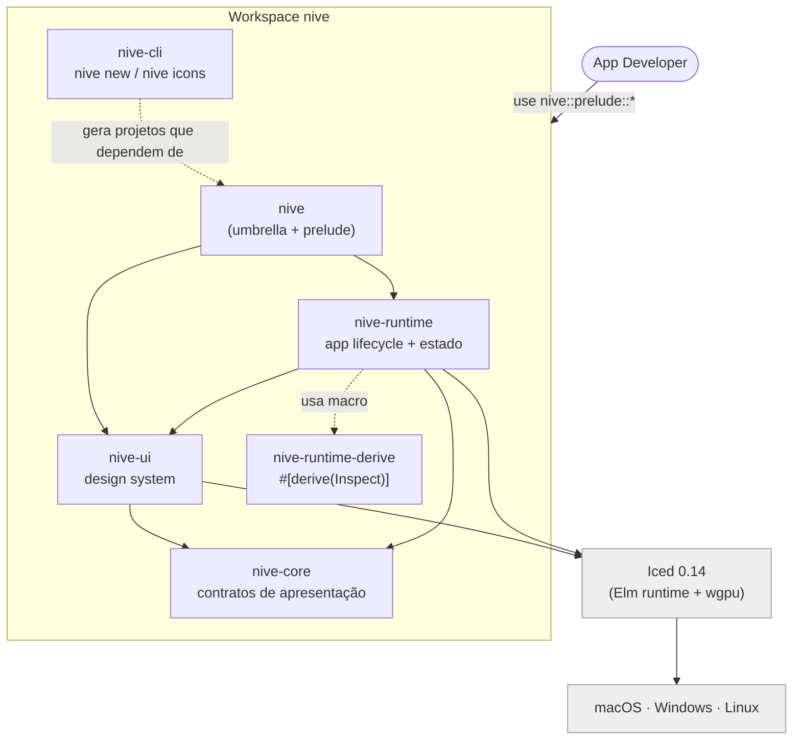

# Arquitetura do Nive — Diagramas

Visão geral do **estado atual** da arquitetura, design e APIs do framework. Os diagramas
usam sintaxe [Mermaid](https://mermaid.js.org/) padrão e são organizados pelos níveis do
[modelo C4](https://c4model.com/). Renderiza direto no GitHub e em qualquer viewer
Mermaid.

> Gerado a partir da inspeção do código em `crates/` (workspace `nive`). Reflete o que
> **existe hoje**, não o roadmap. Para o plano futuro, ver [`../roadmap.md`](../roadmap.md).
>
> **Base de referência:** revisado contra `7fa062d` (2026-06-27). Ao mudar arquitetura de
> crate/módulo ou superfície de API, atualize estes diagramas no mesmo PR.

## Índice

| Arquivo | Nível | O que mostra |
|---------|-------|--------------|
| [`context.md`](context.md) | L1 — Contexto | Nive no mundo: devs, usuário final, Iced, SO, crates.io |
| [`containers.md`](containers.md) | L2 — Contêineres | Os 6 crates do workspace e suas dependências |
| [`runtime-components.md`](runtime-components.md) | L3 — Componentes | Módulos internos de `nive-runtime` |
| [`ui-components.md`](ui-components.md) | L3 — Componentes | Módulos internos de `nive-ui` |
| [`runtime-flows.md`](runtime-flows.md) | Comportamento | Loop Elm, bootstrap/splash, ciclo de janela, máquinas de estado async |
| [`design-system.md`](design-system.md) | Design | Tokens → theme → widgets; catálogo de 40+ widgets |
| [`api-surface.md`](api-surface.md) | API | Prelude tiers, contrato `Application`, `Effect`, feature flags |
| [`api-target.md`](api-target.md) | API | Contrato público alvo pré-publicação, renomeações, remoções e decisão sobre `nive-core` |

## Mapa mental (resumo de 1 diagrama)

## Como ler o C4

- **L1 Contexto:** o sistema (Nive) como caixa-preta entre pessoas e sistemas externos.
- **L2 Contêineres:** unidades implantáveis/compiláveis — aqui, os **crates**.
- **L3 Componentes:** blocos internos de um contêiner — aqui, os **módulos Rust**.
- (L4 Código fica a cargo dos diagramas de classe/estado em `runtime-flows.md` e
  `design-system.md`.)

**Legenda de cor:** azul = elemento Nive · cinza = externo (Iced, SO, registry).
