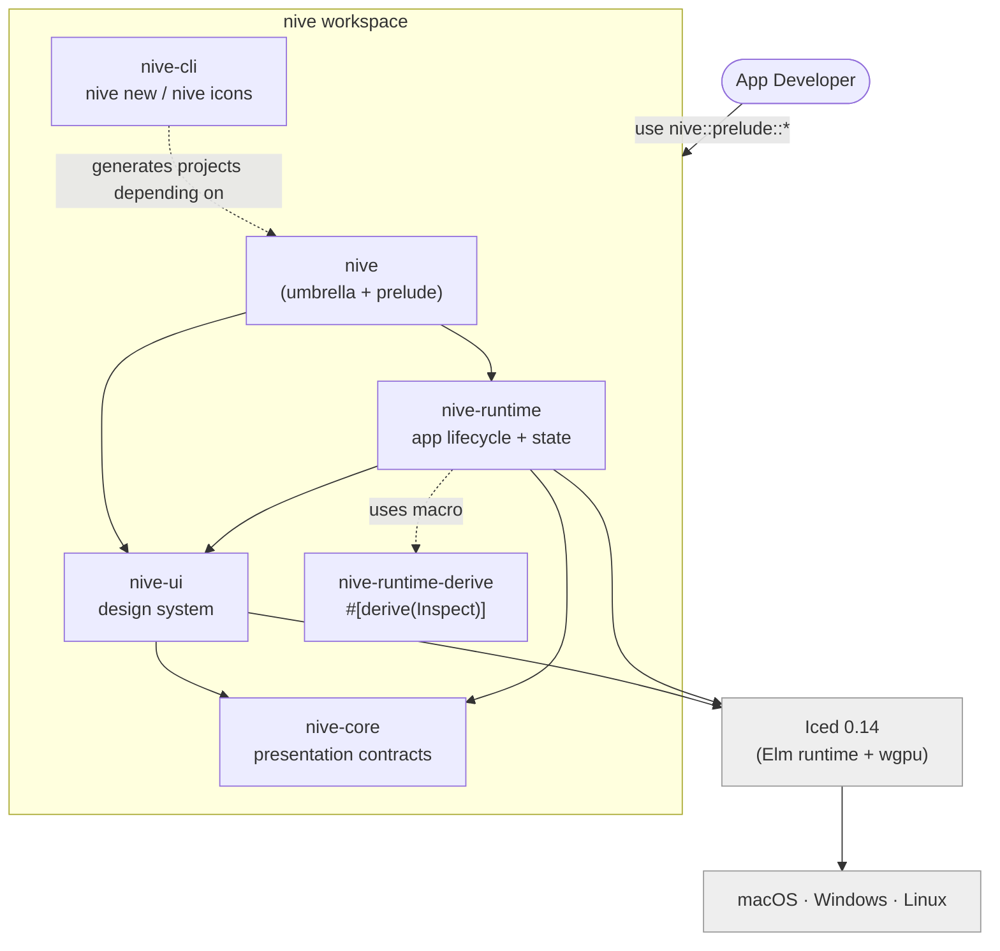

# Nive Architecture — Diagrams

An overview of the framework's **current** architecture, design, and APIs. The
diagrams use standard [Mermaid](https://mermaid.js.org/) syntax and are organised
by [C4 model](https://c4model.com/) level. They render directly on GitHub and in
any Mermaid viewer.

> Generated by reading the code under `crates/` (the `nive` workspace). This
> reflects what **exists today**. Operational planning lives in the
> [Nive GitHub Project](https://github.com/users/JirlanSouza/projects/1); the
> repository keeps only a short [authority pointer](../roadmap.md).
>
> **Reference baseline:** reviewed against `7fa062d` (2026-06-27). When crate or
> module architecture changes, or the API surface moves, update these diagrams in
> the same PR.

## Index

| File | Level | What it shows |
|------|-------|---------------|
| [`context.md`](context.md) | L1 — Context | Nive in the world: developers, end users, Iced, the OS, crates.io |
| [`containers.md`](containers.md) | L2 — Containers | The workspace's 6 crates and their dependencies |
| [`runtime-components.md`](runtime-components.md) | L3 — Components | `nive-runtime`'s internal modules |
| [`ui-components.md`](ui-components.md) | L3 — Components | `nive-ui`'s internal modules |
| [`runtime-flows.md`](runtime-flows.md) | Behaviour | The Elm loop, bootstrap/splash, the window lifecycle, async state machines |
| [`design-system.md`](design-system.md) | Design | Tokens → theme → widgets; a catalogue of 40+ widgets |
| [`api-surface.md`](api-surface.md) | API | Prelude tiers, the `Application` contract, `Effect`, feature flags |
| [`api-target.md`](api-target.md) | API | The target public contract before publication: renames, removals, and the `nive-core` decision |

## Mental map (the whole thing in one diagram)

## Reading the C4 levels

- **L1 Context:** the system (Nive) as a black box among people and external
  systems.
- **L2 Containers:** deployable or compilable units — here, the **crates**.
- **L3 Components:** the blocks inside a container — here, the **Rust modules**.
- (L4 Code is left to the class and state diagrams in `runtime-flows.md` and
  `design-system.md`.)

**Colour legend:** blue = a Nive element · grey = external (Iced, the OS, the
registry).
