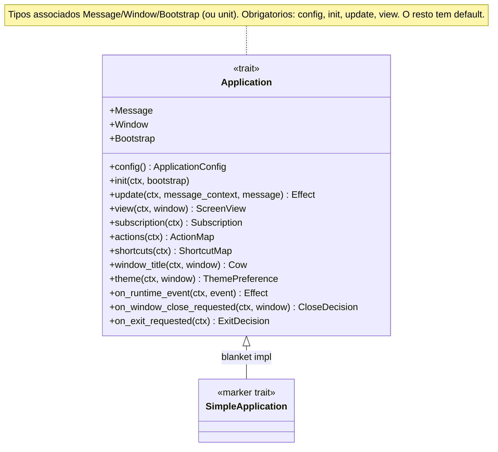
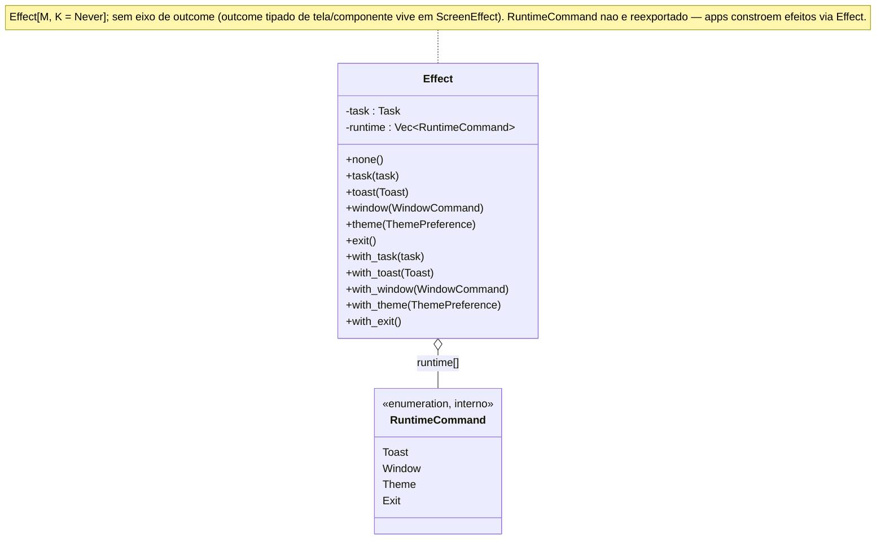
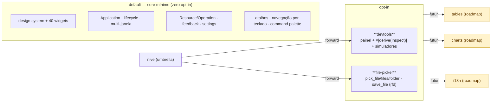

# Superfície de API

O contrato que um app implementa, como a superfície pública é organizada em *prelude tiers*,
e quais APIs ficam atrás de feature flags.

> Este arquivo descreve a superfície existente. As decisões de contrato alvo
> pré-publicação, renomeações e remoções ficam em
> [`api-target.md`](api-target.md).

---

## 1. Prelude tiers (importação estável em camadas)

A superfície é estratificada para que um app simples compile com um único `use`, e apps
maiores subam de tier sob demanda.


**Regra:** o template do `nive new` (counter) compila só com o tier mínimo — que já inclui
toasts básicos (`Toast`), theming (`Theme`/`ThemeBuilder`/`ThemeController`), atalhos
(`ShortcutMap`), ações, eventos de runtime (`RuntimeEvent`) e a *declaração* de janelas
(`WindowSpec`/`WindowRole`). Troque para `nive::prelude::ui::*` ao usar **estado async**
(`Resource`/`Operation`), **dialogs**, **`UserFacingError`**, **bootstrap/splash**
(`BootstrapSpec`/`BrandContent`), **handles de janela em runtime**
(`WindowHandle`/`WindowRegistry`/`WindowMode`), **`ToastDuration`** ou **params de file-picker**.

---

## 2. Módulos runtime por área

Além dos preludes, `nive-runtime` expõe módulos públicos por área para consumidores
diretos da camada runtime:

| Módulo | Papel |
|--------|-------|
| `nive_runtime::application` | Contrato `Application`, `ApplicationConfig`, `Context`, `Effect`, `MessageContext`, eventos de runtime e runner público. |
| `nive_core::actions` | `Action`, `ActionId`, `ActionMap` e atalhos neutros compartilhados. |
| `nive_runtime::input` | Atalhos e navegação por teclado. |
| `nive_runtime::lifecycle` | Bootstrap, decisões de close/exit, `WindowCommand`, specs e registry de janelas. |
| `nive_runtime::state` | `Resource`, `Operation`, `OperationRegistry`, `RequestId`, `Settled` e helpers de tempo. |
| `nive_runtime::feedback` | `Toast`, `ToastState`, `UserFacingError` e tipos relacionados. |
| `nive_runtime::screen` | `ScreenView`, `ScreenEffect` e contratos de dialog. |
| `nive_runtime::settings` | `SettingsConfig`, `RuntimeSession` e sessão de janelas. |
| `nive_runtime::support` | Diagnósticos, panic hook e runtime event log. |

O crate root continua como conveniência beta. Apps devem preferir `nive::prelude::*`,
`nive::prelude::ui::*` ou os módulos por área acima quando quiserem imports mais
explícitos. Helpers de runner, como abertura direta de janela Iced, permanecem internos;
apps emitem `WindowCommand` por `Effect`.

---

## 3. O contrato `Application`

Quatro métodos obrigatórios; o resto tem default. O runtime nunca depende de tipos de
domínio — clientes/serviços entram via `Bootstrap` em `init`.



- **`type Window = ()`** → app de janela única (auto-registra `WindowSpec::app()`).
- **`type Bootstrap = ()`** → sem splash, init imediato.
- **`SimpleApplication`** é um marcador automático (blanket impl) — apps nunca o implementam
  à mão; existe porque defaults de tipo associado são instáveis no Rust stable.

---

## 4. `Effect` — composição de efeitos

O valor de retorno dos hooks. Combina um `Task` async e comandos de runtime ordenados,
construídos com construtores diretos (`Effect::task`, `Effect::toast`, ...) e combinadores
`with_*` para compor múltiplos efeitos.



Exemplo de uso direto:

```rust
Effect::task(self.users.load(fetch_users(), Msg::UsersSettled))
    .with_toast(Toast::success("Salvo"))
    .with_window(WindowCommand::Open(Window::Details));
```

---

## 5. Feature flags & modularidade



| Feature | Status | Expõe |
|---------|--------|-------|
| `devtools` | ✅ | `devtools`, `run_with_devtools`, `Inspect`, simuladores |
| `file-picker` | ✅ | `pick_*`, `save_file`, `FileFilter`, `PickFileParams`, `SaveFileParams` |
| `tables`, `charts`, `i18n` | ⬜ roadmap | (ver [`../roadmap.md`](../roadmap.md)) |

**Estabilidade:** os prelude tiers são o contrato atual de app, mas ainda podem receber
breaking changes pré-publicação conforme [`api-target.md`](api-target.md). APIs feature-gated
(devtools/inspect) permanecem beta até 1.0. Restrição a `unsafe` honrada — 2 ocorrências: o
FFI objc2 do ícone de app (`platform/app_icon.rs`) e um `transmute_copy` da janela-unit no
program runner (`application/program.rs`).
