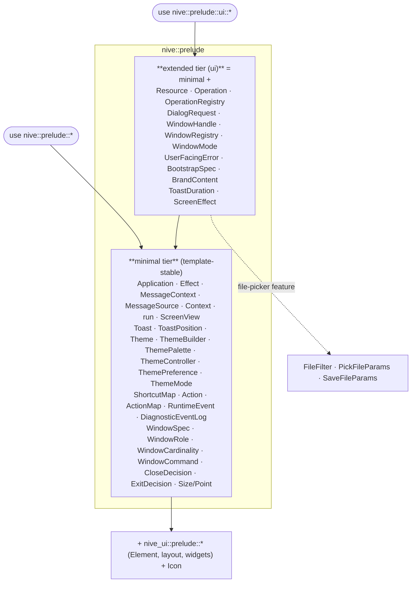
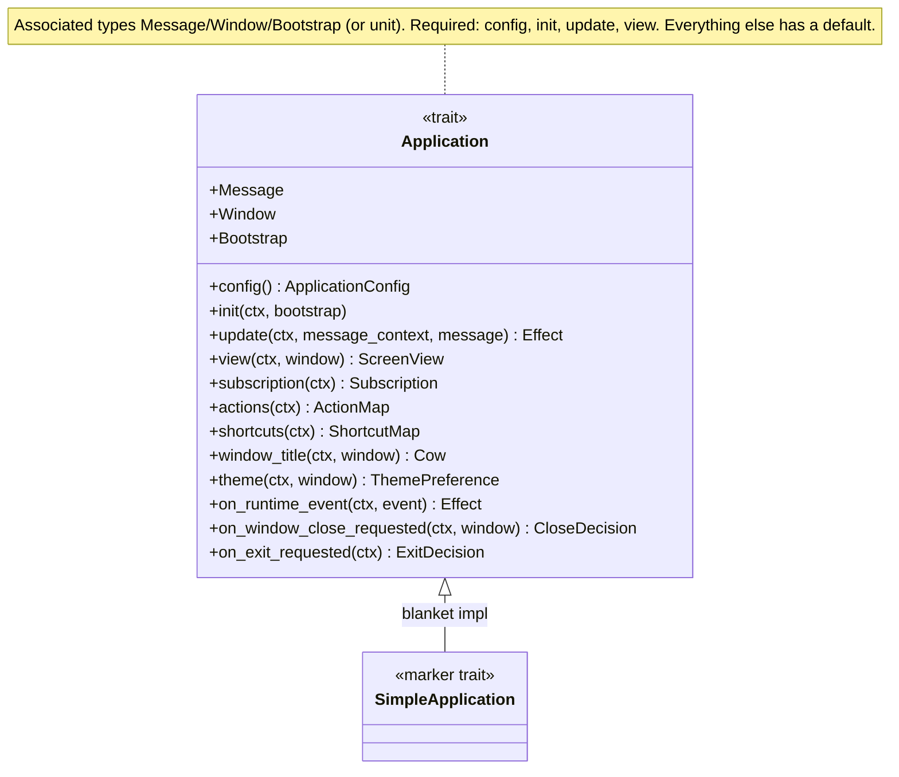
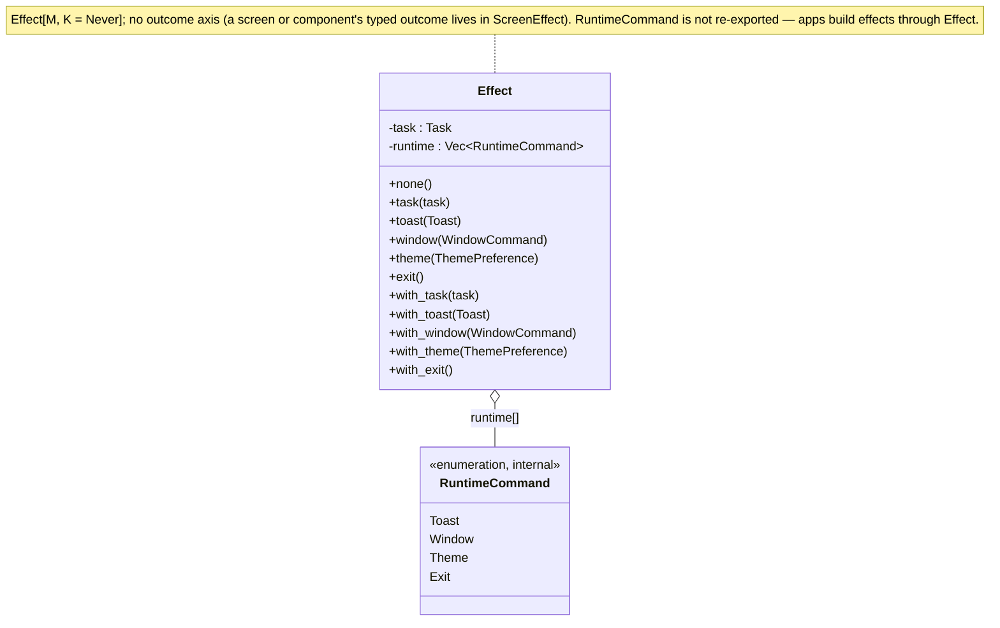
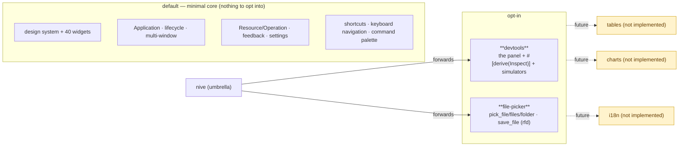

# API Surface

The contract an app implements, how the public surface is layered into *prelude
tiers*, and which APIs sit behind feature flags.

> This file describes the surface that exists. Target-contract decisions for
> before publication — renames and removals — live in
> [`api-target.md`](api-target.md).

---

## 1. Prelude tiers (stable layered imports)

The surface is stratified so a simple app compiles with a single `use`, and
larger apps move up a tier when they need to.



**The rule:** the `nive new` template (a counter) compiles on the minimal tier
alone — which already carries basic toasts (`Toast`), theming
(`Theme`/`ThemeBuilder`/`ThemePalette`/`ThemeController`), shortcuts
(`ShortcutMap`), actions, runtime events (`RuntimeEvent`), and window
*declaration* (`WindowSpec`/`WindowRole`). Move to `nive::prelude::ui::*` for
**async state** (`Resource`/`Operation`), **dialogs**, **`UserFacingError`**,
**bootstrap/splash** (`BootstrapSpec`/`BrandContent`), **runtime window handles**
(`WindowHandle`/`WindowRegistry`/`WindowMode`), **`ToastDuration`**, or
**file-picker params**.

A tier that exports a builder exports every type that builder's methods accept,
so an app never has to reach past `nive` to call one.

---

## 2. Runtime modules by area

Besides the preludes, `nive-runtime` exposes public modules per area for direct
consumers of the runtime layer:

| Module | Role |
|--------|------|
| `nive_runtime::application` | The `Application` contract, `ApplicationConfig`, `Context`, `Effect`, `MessageContext`, runtime events, and the public runner. |
| `nive_core::actions` | `Action`, `ActionId`, `ActionMap`, and the shared neutral shortcuts. |
| `nive_runtime::input` | Shortcuts and keyboard navigation. |
| `nive_runtime::lifecycle` | Bootstrap, close/exit decisions, `WindowCommand`, window specs and registry. |
| `nive_runtime::state` | `Resource`, `Operation`, `OperationRegistry`, `RequestId`, `Settled`, and time helpers. |
| `nive_runtime::feedback` | `Toast`, `ToastState`, `UserFacingError`, and related types. |
| `nive_runtime::screen` | `ScreenView`, `ScreenEffect`, and the dialog contracts. |
| `nive_runtime::settings` | `SettingsConfig`, `RuntimeSession`, and the window session. |
| `nive_runtime::support` | Diagnostics, the panic hook, and the runtime event log. |

The crate root remains an alpha convenience. Apps should prefer
`nive::prelude::*`, `nive::prelude::ui::*`, or the per-area modules above when
they want more explicit imports. Runner helpers such as opening an Iced window
directly stay internal; apps emit `WindowCommand` through `Effect`.

---

## 3. The `Application` contract

Four required methods; everything else has a default. The runtime never depends
on domain types — clients and services arrive through `Bootstrap` in `init`.



- **`type Window = ()`** → a single-window app (auto-registers `WindowSpec::app()`).
- **`type Bootstrap = ()`** → no splash, immediate init.
- **`SimpleApplication`** is an automatic marker (blanket impl) — apps never
  implement it by hand. It exists because associated-type defaults are unstable
  on stable Rust.

---

## 4. `Effect` — composing effects

The return value of the hooks. It combines an async `Task` with ordered runtime
commands, built through direct constructors (`Effect::task`, `Effect::toast`, …)
and `with_*` combinators for composing several effects.



Direct use:

```rust
Effect::task(self.users.load(fetch_users(), Msg::UsersSettled))
    .with_toast(Toast::success("Saved"))
    .with_window(WindowCommand::Open(Window::Details));
```

---

## 5. Feature flags and modularity



| Feature | Status | Exposes |
|---------|--------|---------|
| `devtools` | ✅ | `devtools`, `run_with_devtools`, `Inspect`, the simulators |
| `file-picker` | ✅ | `pick_*`, `save_file`, `FileFilter`, `PickFileParams`, `SaveFileParams` |
| `tables`, `charts`, `i18n` | Not implemented | Track delivery in the [Nive GitHub Project](https://github.com/users/JirlanSouza/projects/1) |

**Stability:** the prelude tiers are the current app contract, and can still take
breaking changes before publication per [`api-target.md`](api-target.md).
Feature-gated APIs (devtools/inspect) stay unstable until 1.0. The `unsafe`
restriction holds — two occurrences: the objc2 FFI for the app icon
(`platform/app_icon.rs`) and a unit-window `transmute_copy` in the program runner
(`application/program.rs`).
