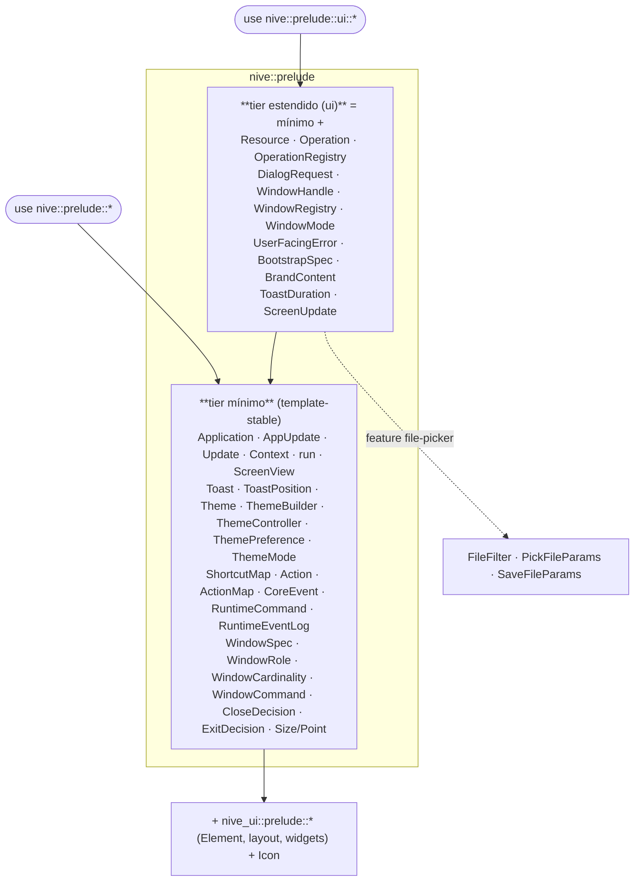
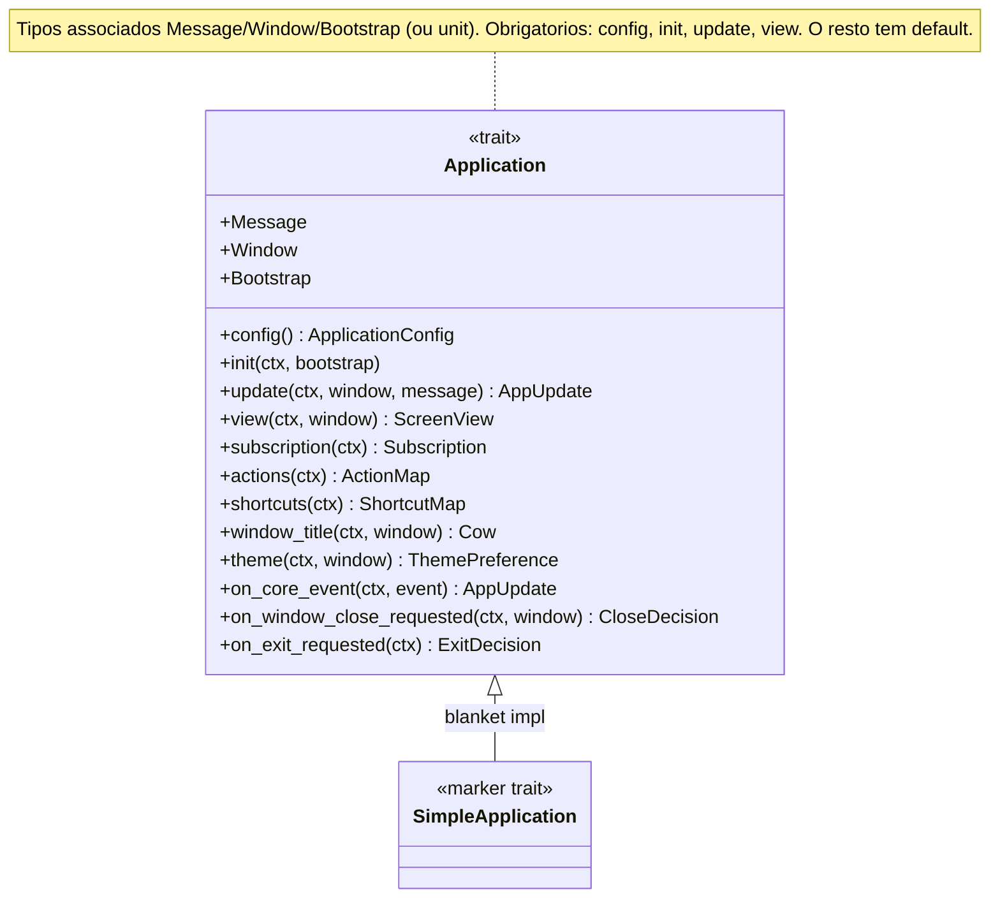
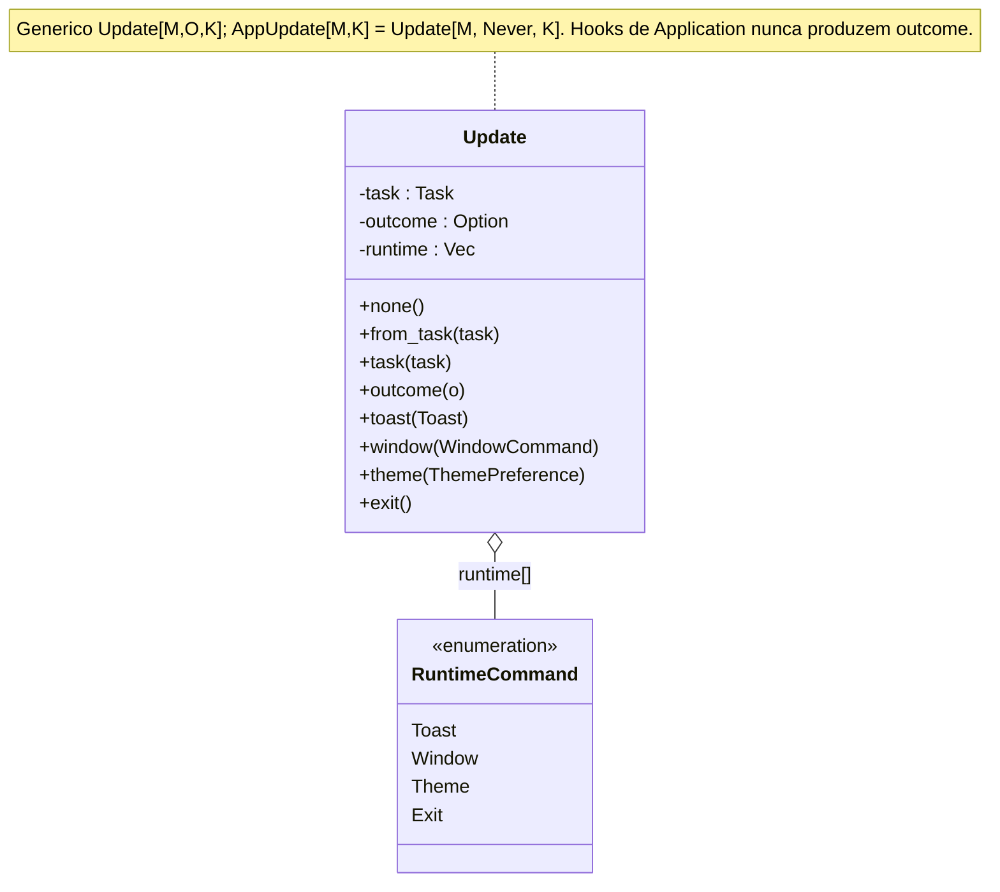
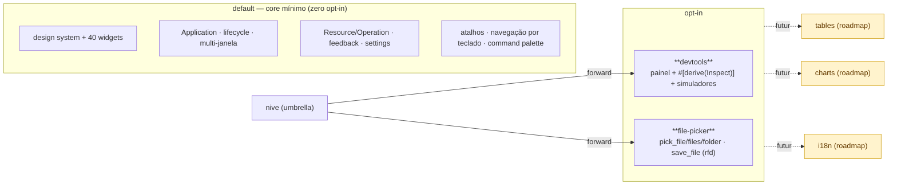

# Superfície de API

O contrato que um app implementa, como a superfície pública é organizada em *prelude tiers*,
e quais APIs ficam atrás de feature flags.

---

## 1. Prelude tiers (importação estável em camadas)

A superfície é estratificada para que um app simples compile com um único `use`, e apps
maiores subam de tier sob demanda.



**Regra:** o template do `nive new` (counter) compila só com o tier mínimo — que já inclui
toasts básicos (`Toast`), theming (`Theme`/`ThemeBuilder`/`ThemeController`), atalhos
(`ShortcutMap`), ações, eventos de runtime (`CoreEvent`) e a *declaração* de janelas
(`WindowSpec`/`WindowRole`). Troque para `nive::prelude::ui::*` ao usar **estado async**
(`Resource`/`Operation`), **dialogs**, **`UserFacingError`**, **bootstrap/splash**
(`BootstrapSpec`/`BrandContent`), **handles de janela em runtime**
(`WindowHandle`/`WindowRegistry`/`WindowMode`), **`ToastDuration`** ou **params de file-picker**.

---

## 2. O contrato `Application`

Quatro métodos obrigatórios; o resto tem default. O runtime nunca depende de tipos de
domínio — clientes/serviços entram via `Bootstrap` em `init`.



- **`type Window = ()`** → app de janela única (auto-registra `WindowSpec::app()`).
- **`type Bootstrap = ()`** → sem splash, init imediato.
- **`SimpleApplication`** é um marcador automático (blanket impl) — apps nunca o implementam
  à mão; existe porque defaults de tipo associado são instáveis no Rust stable.

---

## 3. `Update` — composição de efeitos

O valor de retorno dos hooks. Combina um `Task` async, um `outcome` opcional e comandos de
runtime ordenados, construídos fluentemente.



Exemplo de uso fluente:

```rust
AppUpdate::none()
    .task(self.users.load(fetch_users(), Msg::UsersSettled))
    .toast(Toast::success("Salvo"))
    .window(WindowCommand::Open(Window::Details));
```

---

## 4. Feature flags & modularidade



| Feature | Status | Expõe |
|---------|--------|-------|
| `devtools` | ✅ | `devtools`, `run_with_devtools`, `Inspect`, simuladores |
| `file-picker` | ✅ | `pick_*`, `save_file`, `FileFilter`, `PickFileParams`, `SaveFileParams` |
| `tables`, `charts`, `i18n` | ⬜ roadmap | (ver [`../roadmap.md`](../roadmap.md)) |

**Estabilidade:** prelude tiers já são estáveis; APIs feature-gated (devtools/inspect)
permanecem beta até 1.0. Restrição a `unsafe` honrada — 2 ocorrências: o FFI objc2 do ícone
de app (`platform/app_icon.rs`) e um `transmute_copy` da janela-unit no program runner
(`application/program.rs`).
