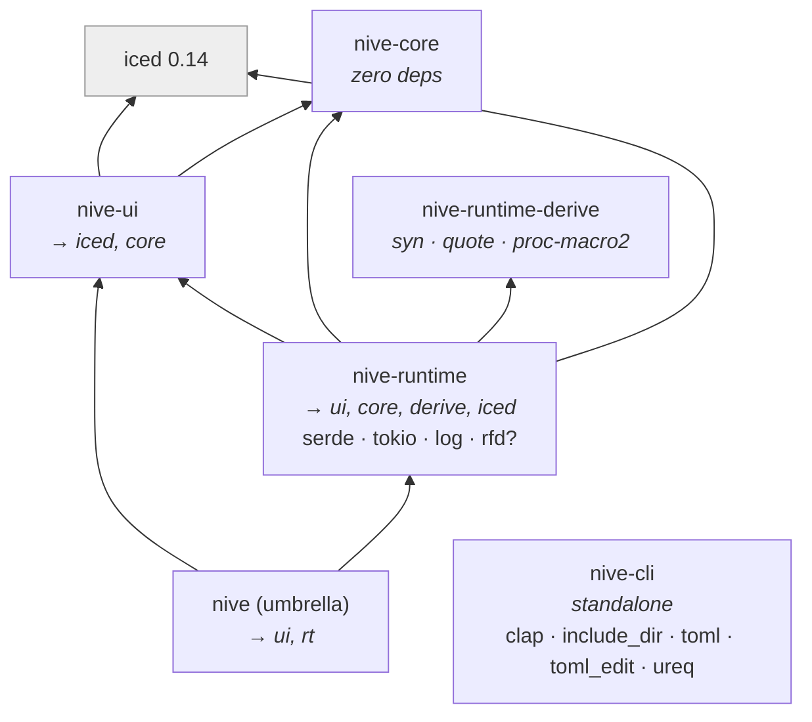

# L2 — Container Diagram (crates)

Nive's containers are the workspace's **crates**. Each is a compilable unit
publishable to crates.io.

```mermaid
flowchart LR
    dev([App Developer])

    subgraph nive["Nive Workspace"]
        direction TB
        umbrella["nive<br/>crate (umbrella)<br/>Re-exports ui+runtime; defines the stable prelude tiers; forwards the devtools/file-picker features"]
        ui["nive-ui<br/>crate<br/>Design system: tokens, a semantic role-based theme, 40+ widgets, overlay hosts. Depends on iced and nive-core."]
        rt["nive-runtime<br/>crate<br/>Application/Effect, lifecycle, multi-window, async state machines, feedback, settings, devtools"]
        core["nive-core<br/>crate<br/>Neutral presentation contracts (error, toast, status). Zero dependencies."]
        derive["nive-runtime-derive<br/>proc-macro crate<br/>#[derive(Inspect)] for devtools state traversal"]
        cli["nive-cli<br/>binary crate<br/>nive new (scaffold, with --dashboard), nive init (adopt), and nive icons (provider-neutral manifest)"]
    end

    iced["Iced 0.14<br/>GUI runtime / wgpu"]
    rfd["rfd / objc2 / winres<br/>Platform FFI (feature-gated)"]
    icon_providers["Icon providers<br/>Lucide over ureq/cache, and local custom SVGs"]

    dev -->|use nive::prelude::*| umbrella
    umbrella -->|re-exports| ui
    umbrella -->|re-exports| rt
    rt -->|depends on, re-exporting its stable APIs| ui
    rt -->|uses<br/>Inspect| derive
    rt -->|depends on presentation contracts| core
    ui -->|depends on presentation contracts| core
    ui -->|depends on| iced
    rt -->|depends on| iced
    rt -->|platform/ (file-picker, app_icon)| rfd
    dev -->|cargo install nive-cli| cli
    cli -->|nive icons compiles refs from| icon_providers
    cli -->|generates projects depending on<br/>templates| umbrella

    classDef person fill:#f7f7f7,stroke:#666,color:#222;
    classDef container fill:#e8f1ff,stroke:#4b77be,color:#111;
    classDef external fill:#eee,stroke:#999,color:#333;
    class dev person;
    class umbrella,ui,rt,core,derive,cli container;
    class iced,rfd,icon_providers external;
```

## Dependency graph (compilation)

Strict layers, no cycles. `nive-ui` is the lowest layer and **knows nothing**
about the runtime.



## Notes

| Crate | Role | Features | Note |
|-------|------|----------|------|
| `nive-core` | Presentation contracts | `default = []` | Lowest layer; **zero dependencies**, not even `iced` |
| `nive-ui` | Design system | `default = []` | Base UI layer; depends on `iced` and `nive-core` |
| `nive-runtime` | Runtime/lifecycle | `devtools`, `file-picker` | The glue; re-exports `nive-ui`'s stable APIs and implements `nive-core`'s contracts |
| `nive-runtime-derive` | Proc macro | `devtools` | `#[derive(Inspect)]`; becomes a no-op without the feature |
| `nive` | Umbrella + prelude | `devtools`, `file-picker` (forwarded) | The stable surface applications should depend on |
| `nive-cli` | DX tool | — | Does **not** depend on the framework crates; scaffolds and fetches through templates and the network |

- **`nive-cli` is decoupled:** it scaffolds projects from embedded templates
  (`include_dir`) and compiles `icons.toml` into checked modules and assets. It
  does not link against `nive`, `nive-ui`, or `nive-runtime` — which is why it
  derives `IconRole` variants from role names rather than holding a table of
  them: the code it generates is compiled against whichever `nive` the app
  depends on, not against the CLI's own build.
- **`nive new --dashboard`** generates a dashboard-shaped app variant, the natural
  starting point for the roadmap's dense examples. **`nive init`** is the other
  door: it adopts Nive in a crate that already exists.
