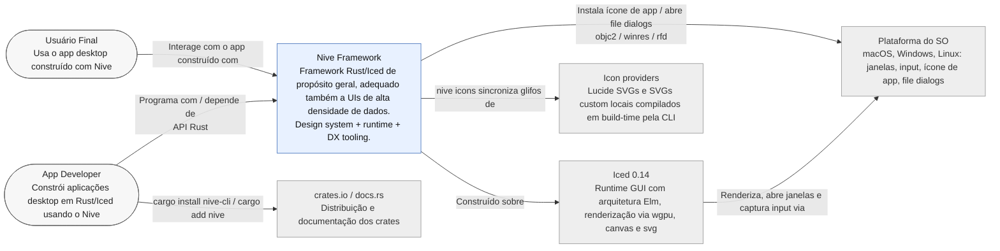

# L1 — Diagrama de Contexto

Nive como caixa-preta entre as pessoas que o usam e os sistemas externos sobre os quais se
apoia.

## Notas

- **Domínio-agnóstico na fronteira:** o runtime nunca depende de tipos de domínio do app;
  clientes/serviços do produto são construídos no *bootstrap* e injetados em
  `Application::init`.
- **Dois consumidores humanos:** o *App Developer* (API/DX) e o *Usuário Final* (a UI
  renderizada). O roadmap equilibra ambos: DX para o dev, densidade/performance para o
  usuário.
- O acoplamento ao SO é fino e isolado em `platform/` (ícone de app, file picker). O
  workspace tem apenas **2 ocorrências de `unsafe`**: o FFI objc2 do ícone de app no macOS
  (`platform/app_icon.rs`) e um `transmute_copy::<(), Window>` no *program runner*
  (`application/program.rs`) que materializa a janela-unit de apps de janela única.
