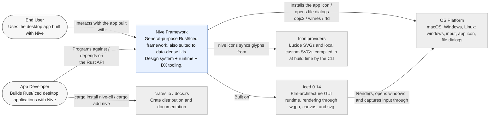

# L1 — Context Diagram

Nive as a black box between the people who use it and the external systems it
rests on.

## Notes

- **Domain-agnostic at the boundary:** the runtime never depends on the app's
  domain types; product clients and services are built during *bootstrap* and
  injected into `Application::init`.
- **Two human consumers:** the *App Developer* (API and DX) and the *End User*
  (the rendered UI). Nive balances both: DX for the developer, density and
  performance for the user.
- **Two doors in:** `nive new <name>` creates a project — registering it as a
  member when a workspace sits above it, without which Cargo refuses the build —
  and `nive init` adopts Nive in a crate that already exists, writing only what is
  missing and never overwriting a file the author wrote. `cargo add nive` covers
  the dependency but not the icon workflow the CLI establishes.
- Coupling to the OS is thin and isolated in `platform/` (app icon, file picker).
  The workspace holds only **two occurrences of `unsafe`**: the objc2 FFI for the
  macOS app icon (`platform/app_icon.rs`), and a `transmute_copy::<(), Window>` in
  the *program runner* (`application/program.rs`) that materialises the unit
  window of single-window apps.
