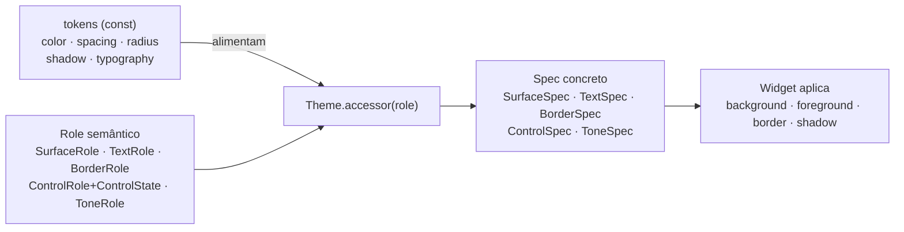
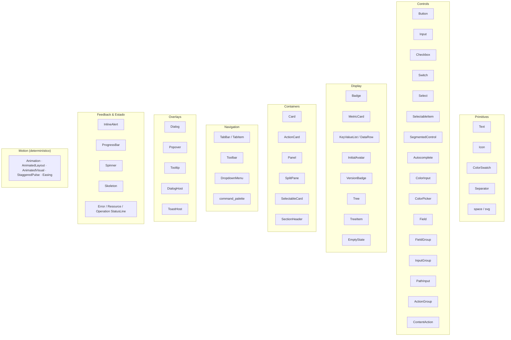

# Design System — Theme & Catálogo de Widgets

Como o design system de `nive-ui` está estruturado: tokens primitivos → tema semântico por
*roles* → specs concretos → widgets.

---

## 1. Modelo do Theme (diagrama de classes)

`Theme` resolve **roles semânticos** (intenção: "superfície de painel", "texto mudo",
"borda de foco") em **specs concretos** (cor, borda, sombra). Os widgets nunca leem cores
cruas — pedem por role.

## 2. Resolução por Role (token → role → spec → pixel)

`ControlState` (enabled · selected · `InteractionState{hovered,pressed,focused,dragged}`)
permite que um único role de controle cubra todos os estados visuais sem ramificação manual
no widget.

> **Lacuna do roadmap:** hoje `tokens::color` é hex/RGB. A migração para **OKLCH** (M0) entra
> exatamente nesta camada de tokens, sem mexer na API de roles acima.

---

## 3. Shape, Tone E Controles

### Shape scale

`ShapeSize` é uma escala ordenada, não um role semântico. Use `ShapeSize`
quando o raio é escolhido por tamanho; roles continuam reservados para
semântica como `SurfaceRole`, `TextRole`, `BorderRole` e `ToneRole`.

| `ShapeSize` | Token | Valor |
| --- | --- | --- |
| `None` | inline | `0.0` |
| `Xs` | `radius::XS` | `2.0` |
| `Sm` | `radius::SM` | `4.0` |
| `Md` | `radius::MD` | `6.0` |
| `Lg` | `radius::LG` | `8.0` |
| `Xl` | `radius::XL` | `12.0` |
| `Xxl` | `radius::XXL` | `16.0` |
| `Full` | `radius::FULL` | `9999.0` |

`ShapeSize::Full` significa cápsula/círculo e é intencionalmente separado dos
maiores tokens numéricos (`XXXL = 24.0`, `XXXXL = 32.0`). Renderers do Iced
clampam o raio ao menor eixo, então `FULL` resolve como pill sem o widget
calcular tamanho.

Exatamente cinco superfícies expõem shape público:
`Card`, `Panel`, `ActionCard`, `SelectableCard` e `SkeletonCard`. Elas usam
`shape(ShapeSize)`, `shape_xs()`...`shape_xxl()`, `square()` e `radius(f32)`.
Não há `shape_full()`/`pill()`; o spelling raro é `shape(ShapeSize::Full)`.
`InitialAvatar::sm()`/`lg()` é a exceção documentada aos atalhos nus, porque
tamanho é o conceito central do avatar.

### Família de cards

`Card`, `ActionCard` e `SelectableCard` compartilham um frame privado com
`ShapeSize::Md` e `PaddingRole::Content`. O eixo público `CardVariant` limita a
apresentação a `Filled` (Panel, sem borda), `Outlined` (transparente, borda de
1 px), `Elevated` (fill e shadow Elevated) e `Ghost` (transparente). Roles
estruturais não são um eixo livre de cards.

`Card` é passivo; `ActionCard` representa uma ação imediata na superfície
inteira; `SelectableCard` representa seleção persistente controlada pelo app.
Os dois últimos têm alvo mínimo de 48 px e foco interno, mas não recebem
`ControlSize` nem podem conter outro alvo interativo. Títulos recomendados
usam `TypographyRole::BodyStrong` completo, 14 px semibold e line-height 1.5.

`MetricCard` permanece display sem superfície: label secundária primeiro,
valor primário de 20 px, unidade muted na mesma baseline e status/trend
separados. O host `Card` é o único dono do chrome.

### Tone scale

`ToneRole` usa `Accent` para a cor de marca/sistema. `Primary` fica reservado
para hierarquia de texto (`TextRole::Primary`) e para ação sugerida em botões.

| `ToneRole` | Uso |
| --- | --- |
| `Neutral` | estado neutro ou informativo sem destaque de marca |
| `Accent` | marca/sistema, antes chamado de primary tone |
| `Info` | informação |
| `Success` | sucesso |
| `Warning` | atenção |
| `Danger` | erro/falha/risco |

Widgets que expõem `tone(ToneRole)` também expõem
`neutral()`, `accent()`, `info()`, `success()`, `warning()` e `danger()`.
`danger()` é linguagem de status. Ações que podem destruir dados usam
`destructive()` em `Button`, `DropdownMenuItem`, `ToolbarAction` e
`ContentAction`; esses
widgets não expõem `danger()`. `ToolbarAction` também não tem `suggested()`
para evitar hierarquia visual forte dentro de toolbars.

### Button intent × variant

`Button` separa intenção da ação e aparência:

| Eixo | Valores |
| --- | --- |
| `ButtonIntent` | `Neutral`, `Suggested`, `Destructive` |
| `ButtonVariant` | `Solid`, `Subtle`, `Outline`, `Ghost` |

Atalhos de alto nível continuam existindo e mapeiam para pares:

| Atalho | Par |
| --- | --- |
| `primary()` / `button::primary` | `Suggested + Solid` |
| `secondary()` / `button::secondary` | `Neutral + Subtle` |
| `outline()` / `button::outline` | `Neutral + Outline` |
| `ghost()` / `button::ghost` | `Neutral + Ghost` |
| `destructive()` / `button::destructive` | `Destructive + Solid` |
| `button::icon` | `Neutral + Ghost` |

`ButtonVariant::Link`, `button::link(...)` e `Button::link()` não fazem parte
do botão. Links terão controle dedicado quando a área de navegação precisar.

### Dense desktop default

`ControlSize::Sm` é o default operacional denso do catálogo. `Xs`, `Md` e `Lg`
são ajustes locais; `ThemeDensity` muda a compactness global mantendo o mesmo
vocabulário de tamanho local. Em chrome composto de workbench,
`WorkbenchShell::chrome_size(ControlSize)` escolhe uma única escala local para
todas as regiões gerenciadas, sem criar knobs por região.

## 4. Density (`ThemeDensity`)

`ThemeDensity` é um eixo global de compactness que afeta spacing, paddings, gaps,
alturas de controle, tamanhos de ícone e chrome de widgets. Existem três variantes:

- **`Comfortable`** — métricas mais espaçosas
- **`Standard`** — baseline de compatibilidade (métricas atuais)
- **`Compact`** — métricas mais densas

### `ThemeDensity` vs `ControlSize`

| Conceito | Escopo | Semântica |
| --- | --- | --- |
| `ThemeDensity` | Global (tema) | Compactness global da UI: spacing, paddings, gaps, alturas de controle, ícones |
| `ControlSize` | Local (widget ou shell composto) | Tamanho do componente individual ou da escala única de chrome: Xs, Sm, Md, Lg |

Exemplo: um botão `ControlSize::Sm` em um tema `Compact` terá métricas menores
do que um botão `ControlSize::Sm` em um tema `Comfortable`, porque a densidade
global afeta o spacing e as métricas derivadas.

### Resolução

A densidade é resolvida durante a construção do tema:
- `spacing::scale_for_density(density)` retorna a escala de spacing para a densidade
- `component::scale_for_density(density, shapes, typography, spacing)` retorna métricas de controle
- Widgets continuam chamando `theme::spacing()` e `theme::control_metrics(size)` normalmente

---

## 5. Catálogo de Widgets (40+)

Todos são `nive-ui` puros (dependem só de `iced`), type-safe e estilizados por role.
O contrato público é duplo: `nive_ui::widgets::*` continua sendo o facade plano
para app code, enquanto `nive_ui::widgets::{primitives, controls, display,
containers, navigation, overlays e feedback` organiza a taxonomia
final para imports explícitos, docs, gallery e crescimento futuro.

**Hosts & templates** (composição de overlays e templates):
`DialogHost` / `ToastHost` (em `widgets::overlays`) · `BootstrapView` (splash) · `focus_trap`
(ciclo de foco em overlays).

### `SegmentedControl` vs `TabBar`

Use `SegmentedControl` para escolher entre um conjunto pequeno e fixo de modos
ou filtros mutuamente exclusivos. Os itens são opções estáveis da própria
interface e normalmente não têm ciclo de vida independente.

Use `TabBar` para coleções abertas de documentos ou views identificadas por
IDs de domínio. O app controla a lista, a ordem, o item ativo, dirty state,
pinning e política de fechamento; o widget emite intents para selecionar, fechar,
abrir contexto, reordenar e tear-off sem mutar o modelo sozinho.

### Métricas de chrome composto

`TabBar`, `VerticalRail`, `SectionHeader`, `SegmentedControl` plano e as ações
de `Toolbar` derivam a extensão primária de `ControlSize` e das métricas do
tema ativo. Em um `WorkbenchShell`, uma única chamada a `chrome_size(...)`
propaga essa escala para tabs, rails, cabeçalhos, seletor inferior, toolbar,
status e split panes; apps não compensam alinhamento escolhendo tamanhos
diferentes por região.

`SplitPane` também usa `ControlSize`, mas separa o divisor visual/layout de um
pixel lógico do alvo de interação maior e centralizado. O tamanho local ajusta
o grip e o alvo de interação sem alterar a geometria de razão dos painéis.

### Layout grammar

Widgets com layout público usam somente esta gramática:
`width(...)`, `height(...)`, `fill_width()`, `fill_height()`, `fill()` e
`shrink_width()`. `fill()` sempre significa preencher os dois eixos e só existe
onde isso faz sentido (`Tree`, `SplitPane`, superfícies). Widgets inline ou de
barra usam `fill_width()` quando precisam ocupar a linha. Não há `fill_all`,
`fill_both`, `fill_w`, `fill_h` ou `shrink()` público.

Principais defaults:

| Família | Default |
| --- | --- |
| Campos (`Input`, `PathInput`, `Select`, `Field`, `FieldGroup`) | fill width |
| Ações inline (`Button`, `Checkbox`, `Switch`, `SegmentedControl`) | shrink width |
| Superfícies (`Card`, `Panel`, `ActionCard`, `SelectableCard`) | shrink both |
| Viewports (`SplitPane`, `Tree`) | fill both |
| Strips (`Toolbar`, `TabBar`) | shrink width; apps optam por `fill_width()` |
| Ações de conteúdo (`ActionGroup`) | shrink width; `wrap()` é opt-in e não estica itens |

### Interaction vocabulary

Estado e callbacks seguem um vocabulário único:

| Domínio | Spelling |
| --- | --- |
| Desabilitar widget | `disabled(bool)` |
| Selecionáveis | `selected(bool)` |
| Booleanos | `checked(bool)` + `on_toggle(fn(bool) -> Message)` |
| Navegação controlada | `active(...)` |
| Ativação de ação | `on_press(Message)` |
| Valor editável | `on_change(fn(V) -> Message)` |
| Escolha entre opções | `on_select(fn(T) -> Message)` |
| Browse de caminho | `on_browse(Message)` |

Callbacks opcionais usam o par `_maybe`: `on_press_maybe`,
`on_toggle_maybe`, `on_change_maybe`, `on_select_maybe` e
`on_browse_maybe`. `None` remove a mensagem, mas não força visual disabled.
`disabled(true)` sempre vence sobre callbacks presentes.

`Input` e `PathInput` usam `on_change`; `Autocomplete::on_select` entrega o
valor da sugestão, não um índice. `TabBar::on_select` entrega só o id do tab;
`ActivationTrigger` fica interno à fundação de interação. `TreeDrag::enabled()`
e `TreeDrag::disabled()` são a exceção documentada porque constroem presets de
configuração, não estado mutável de widget.

> **Lacunas do roadmap (Fase 2):** o catálogo cobre apps gerais e densos *exceto* os dois
> widgets analíticos pesados — **tabela virtualizada** e **gráfico de série temporal** — que
> entram como features opt-in (`tables`, `charts`).
