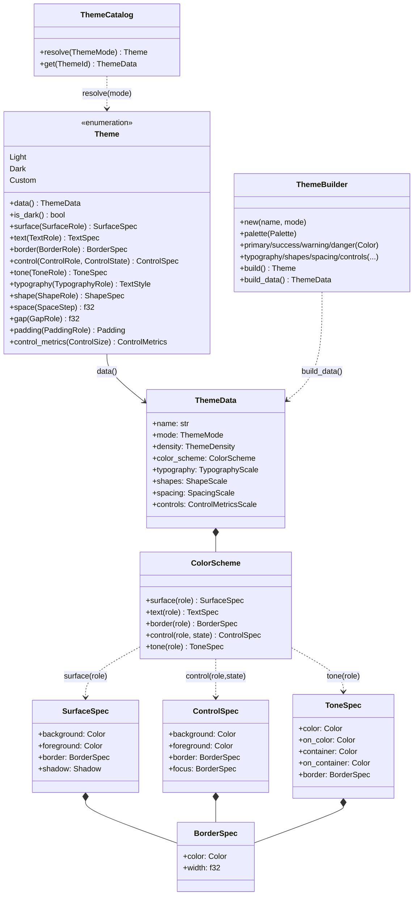
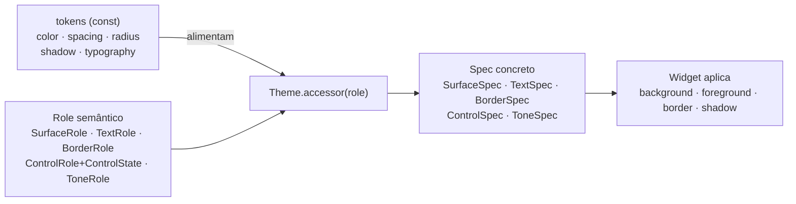
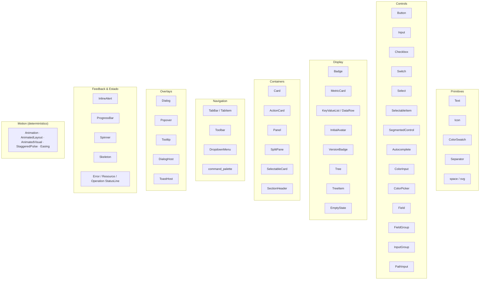

# Design System — Theme & Catálogo de Widgets

Como o design system de `nive-ui` está estruturado: tokens primitivos → tema semântico por
*roles* → specs concretos → widgets.

---

## 1. Modelo do Theme (diagrama de classes)

`Theme` resolve **roles semânticos** (intenção: "superfície de painel", "texto mudo",
"borda de foco") em **specs concretos** (cor, borda, sombra). Os widgets nunca leem cores
cruas — pedem por role.

## 2. Resolução por Role (token → role → spec → pixel)

`ControlState` (enabled · selected · `InteractionState{hovered,pressed,focused,dragged}`)
permite que um único role de controle cubra todos os estados visuais sem ramificação manual
no widget.

> **Lacuna do roadmap:** hoje `tokens::color` é hex/RGB. A migração para **OKLCH** (M0) entra
> exatamente nesta camada de tokens, sem mexer na API de roles acima.

---

## 3. Density (`ThemeDensity`)

`ThemeDensity` é um eixo global de compactness que afeta spacing, paddings, gaps,
alturas de controle, tamanhos de ícone e chrome de widgets. Existem três variantes:

- **`Comfortable`** — métricas mais espaçosas
- **`Standard`** — baseline de compatibilidade (métricas atuais)
- **`Compact`** — métricas mais densas

### `ThemeDensity` vs `ControlSize`

| Conceito | Escopo | Semântica |
| --- | --- | --- |
| `ThemeDensity` | Global (tema) | Compactness global da UI: spacing, paddings, gaps, alturas de controle, ícones |
| `ControlSize` | Local (widget) | Tamanho do componente individual: Xs, Sm, Md, Lg |

Exemplo: um botão `ControlSize::Sm` em um tema `Compact` terá métricas menores
do que um botão `ControlSize::Sm` em um tema `Comfortable`, porque a densidade
global afeta o spacing e as métricas derivadas.

### Resolução

A densidade é resolvida durante a construção do tema:
- `spacing::scale_for_density(density)` retorna a escala de spacing para a densidade
- `component::scale_for_density(density, shapes, typography, spacing)` retorna métricas de controle
- Widgets continuam chamando `theme::spacing()` e `theme::control_metrics(size)` normalmente

---

## 4. Catálogo de Widgets (40+)

Todos são `nive-ui` puros (dependem só de `iced`), type-safe e estilizados por role.
O contrato público é duplo: `nive_ui::widgets::*` continua sendo o facade plano
para app code, enquanto `nive_ui::widgets::{primitives, controls, display,
containers, navigation, overlays e feedback` organiza a taxonomia
final para imports explícitos, docs, gallery e crescimento futuro.

**Hosts & templates** (composição de overlays e templates):
`DialogHost` / `ToastHost` (em `widgets::overlays`) · `BootstrapView` (splash) · `focus_trap`
(ciclo de foco em overlays).

> **Lacunas do roadmap (Fase 2):** o catálogo cobre apps gerais e densos *exceto* os dois
> widgets analíticos pesados — **tabela virtualizada** e **gráfico de série temporal** — que
> entram como features opt-in (`tables`, `charts`).
