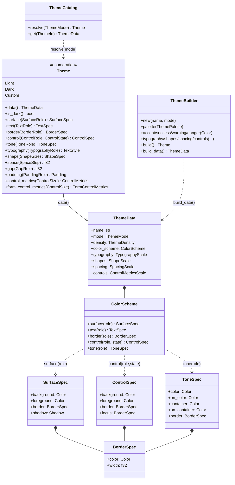
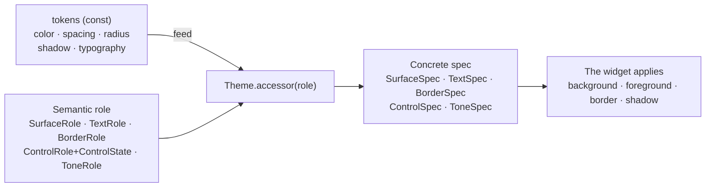
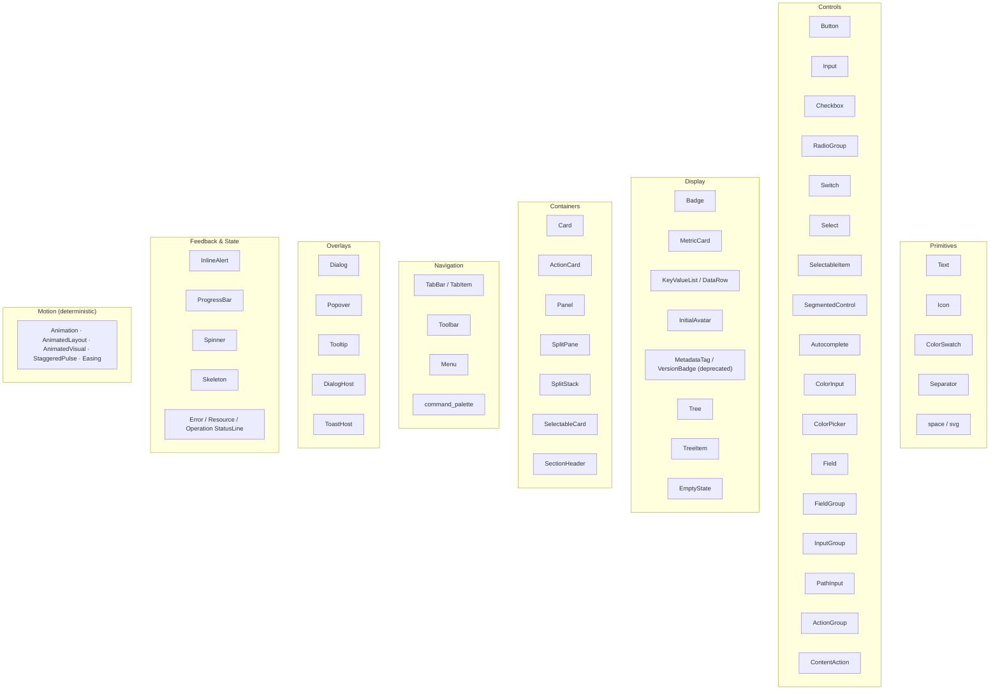

# Design System — Theme and Widget Catalogue

How `nive-ui`'s design system is structured: primitive tokens → a semantic theme
of *roles* → concrete specs → widgets.

---

## 1. The Theme model (class diagram)

`Theme` resolves **semantic roles** (the intent: "panel surface", "muted text",
"focus border") into **concrete specs** (colour, border, shadow). Widgets never
read raw colours — they ask by role.



### What the app controls, and what is derived

The app assembles a theme through `ThemeBuilder` and hands the pair over with
`ApplicationConfig::theme_catalog(ThemeCatalog::new(light, dark))`. What it
defines:

| surface | type |
|---|---|
| six colours | `ThemePalette`, or the `accent`/`text`/`app_background`/`success`/`warning`/`danger` setters |
| four scales | `TypographyScale`, `ShapeScale`, `SpacingScale`, `ControlMetricsScale` |
| density | `ThemeDensity` |
| icons | `IconCatalog` |

`ThemeBuilder::from_theme(theme)` starts from an existing theme and changes only
what is needed; `Theme::custom(ThemeData)` accepts the data ready-made.

**What the app does not define:** the ~30 semantic colours — `surface.*`,
`border.*`, `control.*`, `tone.*`. They are derived from the palette by
`ColorScheme::from_palette`, and `ColorScheme`'s fields are private.

This is deliberate. The derivation is what makes the invariants hold for a
branded theme and not only for the defaults: the text contrast floors, the
adjacency between surfaces, and the `idle → hover → pressed` ladder climbing
toward the foreground in both modes. An app that pinned `control.hover` directly
would make those guarantees false for itself, with no warning.

If a specific tone will not come out of the palette, move the palette rather than
piercing the derivation. See [the theming guide](../guides/theming.md).

## 2. Role resolution (token → role → spec → pixel)



`ControlState` (enabled · selected ·
`InteractionState{hovered,pressed,focused,dragged}`) lets a single control role
cover every visual state without manual branching inside the widget.

`ControlRole` answers a question orthogonal to state: does the control have a
body of its own, or does it paint over the surface hosting it? `Standard` and
`Selectable` have a body and fill it at rest. `Embedded` has no chrome of its own
— popup rows, toolbar actions, card and content actions — so at rest and when
disabled it **paints nothing**, letting the host surface show through, and
projects hover/pressed as translucent layers that composite over any host (Panel
through Popover) instead of opaque colours calibrated for one surface. The role
only chooses which fills the state precedence draws from, never the precedence
itself: selection resolves before the role, so the selected ladder is identical
for all of them.

> **Current gap:** `tokens::color` is hex/RGB today. A future **OKLCH**
> implementation belongs at this token layer without touching the role API
> above; delivery is tracked in the GitHub Project.

---

## 3. Shape, Tone, and Controls

### The shape scale

`ShapeSize` is an ordered scale, not a semantic role. Use `ShapeSize` when the
radius is chosen by size; roles stay reserved for semantics such as
`SurfaceRole`, `TextRole`, `BorderRole`, and `ToneRole`.

| `ShapeSize` | Token | Value |
| --- | --- | --- |
| `None` | inline | `0.0` |
| `Xs` | `radius::XS` | `2.0` |
| `Sm` | `radius::SM` | `4.0` |
| `Md` | `radius::MD` | `6.0` |
| `Lg` | `radius::LG` | `8.0` |
| `Xl` | `radius::XL` | `12.0` |
| `Xxl` | `radius::XXL` | `16.0` |
| `Full` | `radius::FULL` | `9999.0` |

`ShapeSize::Full` means capsule or circle and is deliberately separated from the
larger numeric tokens (`XXXL = 24.0`, `XXXXL = 32.0`). Iced's renderers clamp the
radius to the smaller axis, so `FULL` resolves as a pill without the widget
computing a size.

Exactly five surfaces expose public shape: `Card`, `Panel`, `ActionCard`,
`SelectableCard`, and `SkeletonCard`. They use `shape(ShapeSize)`,
`shape_xs()`…`shape_xxl()`, `square()`, and `radius(f32)`. There is no
`shape_full()` or `pill()`; the rare spelling is `shape(ShapeSize::Full)`.
`InitialAvatar::sm()`/`lg()` is the documented exception to bare shortcuts,
because size is the avatar's central concept.

### The card family

`Card`, `ActionCard`, and `SelectableCard` share a private frame with
`ShapeSize::Md` and `PaddingRole::Content`. The public `CardVariant` axis limits
presentation to `Filled` (Panel, no border), `Outlined` (transparent, 1 px
border), `Elevated` (Elevated fill and shadow), and `Ghost` (transparent).
Structural roles are not a free axis on cards.

`Card` is passive; `ActionCard` represents an immediate action across the whole
surface; `SelectableCard` represents persistent selection controlled by the app.
The latter two have a 48 px minimum target and internal focus, but take no
`ControlSize` and cannot contain another interactive target. Recommended titles
use full `TypographyRole::BodyStrong` — 14 px semibold, line height 1.5.

`MetricCard` stays a display without a surface: the secondary label first, a
20 px primary value, a muted unit on the same baseline, and status/trend
separate. The hosting `Card` is the sole owner of the chrome.

### The tone scale

`ToneRole` uses `Accent` for the brand/system colour. `Primary` stays reserved
for text hierarchy (`TextRole::Primary`) and for the suggested action on buttons.

| `ToneRole` | Use |
| --- | --- |
| `Neutral` | a neutral or informative state with no brand emphasis |
| `Accent` | brand/system, formerly called the primary tone |
| `Info` | information |
| `Success` | success |
| `Warning` | caution |
| `Danger` | error, failure, risk |

Widgets exposing `tone(ToneRole)` also expose `neutral()`, `accent()`, `info()`,
`success()`, `warning()`, and `danger()`. `danger()` is status language. Actions
that can destroy data use `destructive()` on `Button`, `MenuCommand`,
`ToolbarAction`, and `ContentAction`; those widgets do not expose `danger()`.
`ToolbarAction` also has no `suggested()`, to avoid strong visual hierarchy
inside toolbars.

### Button intent × variant

`Button` separates the action's intent from its appearance:

| Axis | Values |
| --- | --- |
| `ButtonIntent` | `Neutral`, `Suggested`, `Destructive` |
| `ButtonVariant` | `Solid`, `Subtle`, `Outline`, `Ghost` |

High-level shortcuts still exist and map to pairs:

| Shortcut | Pair |
| --- | --- |
| `primary()` / `button::primary` | `Suggested + Solid` |
| `secondary()` / `button::secondary` | `Neutral + Outline` |
| `tertiary()` / `button::tertiary` | `Neutral + Ghost` |
| `outline()` / `button::outline` | `Neutral + Outline` |
| `ghost()` / `button::ghost` | `Neutral + Ghost` |
| `destructive()` / `button::destructive` | `Destructive + Solid` |
| `button::icon(icon, semantic_name)` | `Neutral + Ghost` |

`ButtonVariant::Link`, `button::link(...)`, and `Button::link()` are not part of
the button. Links will get a dedicated control when the navigation area needs
one.

### Form controls

`FormControlMetrics` projects `ControlSize` onto the metrics shared by `Input`,
`InputGroup`, `Select`, `Autocomplete`, `Field`, `FieldGroup`, and `Button`.
Value text uses `TypographyRole::Control` (Inter Regular 14 px) and button labels
use `ControlStrong` (Inter Semibold 14 px); local size changes geometry, not
typography.

| Density | Xs | Sm | Md | Lg |
| --- | ---: | ---: | ---: | ---: |
| Compact | 20 | 24 | 28 | 32 |
| Standard | 24 | 28 | 32 | 36 |
| Comfortable | 28 | 32 | 36 | 40 |

The `Input`/`InputGroup` frame has a 1 px outer perimeter and a 2 px focus ring
overlaid on a 1 px inner rectangle. Disabled outranks focus, hover, read-only,
and actions; Invalid keeps the Danger perimeter even while focused. The frame
reserves no extra band and multiplies no local opacity.

`Field::new(label, Input/InputGroup/Select/Autocomplete)` is the canonical
composition: Field propagates size and disabled, is the sole owner of validation
when the error is non-empty, and shares the support band between hint and error.
`Field::custom` is a limited escape hatch, leaving focus, semantics, clipping,
and propagation to the caller. `FieldGroup::new(legend, fields)` requires a
visible legend, paints no surface, and offers `Vertical` or a Wrap of equal
tracks. For a finite width `W`, gap `G`, and minimum `M`, Wrap uses
`max(1, floor((W + G) / (M + G)))` columns of width
`max(0, (W - (columns - 1)G) / columns)`; unbounded hosts use Vertical.

`InputGroup` keeps a single frame for the embedded Input plus typed slots for
prefix, unit, semantic icon, labelled status, actions, clear, and activity.
Arbitrary slots are rectangular and leave paint, rounded masking, semantics, and
propagation to the caller. The absence of `on_change` makes an Input read-only,
not Disabled.

Button's public axes remain the advanced surface. The recommended hierarchy is
primary Suggested+Solid, secondary Neutral+Outline, tertiary Neutral+Ghost, and
destructive Destructive+Solid; use only one primary per local group. Icon buttons
require a semantic name separate from the tooltip. This metadata prepares a
future accessibility bridge: Iced 0.14 cannot yet emit every native
name/description/error/group relationship, nor configure the caret colour
independently.

### The dense desktop default

`ControlSize::Sm` is the catalogue's dense operational default. `Xs`, `Md`, and
`Lg` are local adjustments; `ThemeDensity` changes global compactness while
keeping the same local size vocabulary. In composed workbench chrome,
`WorkbenchShell::chrome_size(ControlSize)` picks one local scale for every
managed region, creating no per-region knobs.

### Data, indicators, and identity

`KeyValueList` and `DataRow` paint no surface, border, radius, shadow, or outer
padding. The host is the sole owner of the chrome. Both keep full 14 px Body at
every `ControlSize`; size and density change only gaps and minimum height. The
list has one shared logical column of 96 px. At a finite width `W`, it uses
`L=min(request, 0.40W)`, `G=min(gap, W-L)`, and `V=W-L-G`. `DataRow` protects
Shrink/Fixed peers, shrinks the secondary value before the primary one, and stays
static; whole-row interaction belongs to `SelectableItem`.

| Category | Metrics | Semantic rule |
| --- | --- | --- |
| `Badge` | 20 px height/minimum, 6 px horizontal, pill | `Count` is numeric; `Status` is compact semantic text |
| `ToneDot` | 6 px Xs/Sm; 8 px Md/Lg | a stable state, always accompanied by visible text |
| `StatusIndicator` | dot + secondary Body | replaces compact status stored as a bare `ToneRole` |
| `InitialAvatar` | 24/32/40/56 px | circular for a person, rounded for an entity, `Identity` fallback |
| `MetadataTag` | 20 px, radius 4, padding 6, maximum 168 | a literal technical value, elided in the middle |

A non-empty Status Badge suppresses any other compact status channel; a Count may
coexist with `StatusIndicator`. `Spinner` represents activity, never a stable
state. `AvatarStatus` requires an explicit outline source: `on_surface`,
`with_outline`, or `on_interactive`. Custom icon catalogues should map `identity`
and regenerate their artefacts with `nive icons sync`.

## 4. Density (`ThemeDensity`)

`ThemeDensity` is a global compactness axis affecting spacing, paddings, gaps,
control heights, icon sizes, and widget chrome. There are three variants:

- **`Comfortable`** — roomier metrics
- **`Standard`** — the compatibility baseline (current metrics)
- **`Compact`** — denser metrics

### `ThemeDensity` vs `ControlSize`

| Concept | Scope | Semantics |
| --- | --- | --- |
| `ThemeDensity` | Global (the theme) | Global UI compactness: spacing, paddings, gaps, control heights, icons |
| `ControlSize` | Local (a widget, or a composed shell) | The size of an individual component or of the single chrome scale: Xs, Sm, Md, Lg |

For example, a `ControlSize::Sm` button in a `Compact` theme has smaller metrics
than a `ControlSize::Sm` button in a `Comfortable` one, because global density
affects spacing and the derived metrics.

### Resolution

Density resolves while the theme is built:
- `spacing::scale_for_density(density)` returns the spacing scale for that density
- `component::scale_for_density(density, shapes, typography, spacing)` returns the
  control metrics
- Widgets keep calling `theme::spacing()` and `theme::control_metrics(size)` as
  usual

---

## 5. Widget catalogue (40+)

All of them belong to `nive-ui`, are type-safe, and are styled by role. The crate
depends on `iced` and on `nive-core`'s zero-dependency contracts, but not on
`nive-runtime` or on application crates. The public contract is twofold:
`nive_ui::widgets::*` remains the flat facade for app code, while
`nive_ui::widgets::{primitives, controls, display, containers, navigation,
overlays, feedback}` organises the final taxonomy for explicit imports, docs, the
gallery, and future growth.



**Hosts and templates** (overlay composition and templates): `DialogHost` /
`ToastHost` (in `widgets::overlays`) · `BootstrapView` (splash) · `focus_trap`
(focus cycling in overlays).

### Focus state domains

The design system keeps six distinct concepts:

| Concept | Owner | Rule |
| --- | --- | --- |
| Active focus | `FocusState` + the root coordinator | at most one target receives focused interaction |
| Visible focus | the `FocusVisibility` policy | a visual projection that does not change layout; `Auto` distinguishes keyboard from pointer/touch |
| Logical anchor | one `FocusRoot` per tree/window | a single sequential position, retained after blur while still valid |
| A composite's internal focus | RadioGroup, Segmented, TabBar, Tree, SplitPane, SplitStack, etc. | local highlight/roving/row/handle under a single external Tab stop; a `SplitStack` of N dividers still exposes one target, roving the focused divider |
| Durable selection | a model controlled by the app or component | never cleared by hover, blur, or transient navigation |
| Overlay policy | Popover/Menu/the matching host | entry, containment, dismissal cause, and conditional restore; never a second coordinator |

Iced still determines `focus_next`/`focus_previous` ordering. `FocusRoot` only
centralises the anchor's identity, origin, visibility, and validity, including
across nested overlays. The runtime wraps each window's final content
automatically; standalone apps use `nive_ui::accessibility::FocusRoot`
explicitly. External authors use `nive_ui::advanced::focus::FocusState`; without
a root the local fallback still works, but offers no retention or uniqueness
across widgets.

`DialogHost` projects modal restore as anchor-only. On open it captures the
opaque external target; on close by button, Escape, backdrop, or a controlled
change, it restores that target as a sequential position only — no `active`, no
ring. A newer external programmatic focus wins, and a removed or disabled target
falls through to Iced's native fallback.

### Anchored overlays and popup controls

Dependency and ownership run in one direction:

```text
private geometry/lifecycle kernel
        ├── Tooltip
        └── Popover
              └── Menu
                    ├── Select
                    └── Autocomplete
```

The private kernel measures translated anchors and resolves collision, an 8 px
safe viewport, a 4 px default gap, bounded overflow, nested-overlay priority,
message relay, and `FocusRoot` integration. No renderer, Tree state, clock, focus
adapter, restore target, or `PopoverOverlay` is part of the app API.

`Tooltip` is passive disclosure: 12 px BodySmall text, 4 px vertical and 8 px
horizontal padding, 4 px radius and gap, a 280 px maximum, FlipAndShift, and
reveal by pointer or focus. On its own it uses 500 ms; `TooltipScope` allows
100 ms between distinct neighbours during a 600 ms warm window, keeping scopes and
windows isolated. A tooltip never replaces the anchor's independent semantic
name.

`Popover` controls `open(bool)` and is the sole owner of `SurfaceRole::Popover`,
a 1 px perimeter, an 8 px radius, the shadow, the rectangular outer clip, the
Standard/Compact/EdgeToEdge semantic insets of 12/8/0 px, and a bounded vertical
Scrollable. Content adds no `Panel`, no second radius, and no second Scrollable.
On Iced 0.14, arbitrary EdgeToEdge descendants get no generic rounded mask;
canonical lists use a 4 px inner inset. The default geometry is BottomStart,
FlipAndShift, Content, a 4 px gap, and an 8 px safe viewport; automatic width
stops at 360 px, while AtLeastAnchor preserves a wider safe anchor.

`PopoverFocusPolicy` separates RetainAnchor, FocusFirst, and Trap over the same
root coordinator. Dismissal by Escape, an external primary press, or an owned
activation publishes a message only when the capability exists, and restores the
still-valid opaque target only after the app supplies closed state. A missing
callback creates no hidden close and no Disabled appearance; a programmatic close
is silent.

`Menu` internally configures Popover EdgeToEdge + FocusFirst and keeps a single
Tab stop for the whole chain. Rows are fixed at 28 px, with stable columns,
bounded navigation, Home/End, a 700 ms typeahead, and submenus on physical LTR
Right/Left. Commands project `nive_core::Action<M>`; checkbox and radio remain
typed models controlled by the app. DismissAll publishes the leaf first and
dismissal once when available; KeepOpen never closes. A missing callback makes
only the leaf display-only, while `disabled(true)` takes precedence and preserves
state and geometry.

`SelectOption<T>` separates a unique value from its label, and Select keeps
`Option<T>` controlled by the app. The field is fill width, Sm by default,
integrates the typed `FieldControl`, and opens Menu rows in a single
AtLeastAnchor Popover. `AutocompleteSuggestion<T>` and
`AutocompleteResults::{Suggestions, Loading, Empty, Error}` keep results atomic;
the app owns the query, filtering and ordering, retrieval, and selection. The
caret stays in the Input and logical highlight does not change the query. A
retrieval Error is popup content, never an implicit `FieldValidation::Invalid`.

Menu, Select, and Autocomplete resolve row fill through one shared projection
(`ControlRole::Embedded`), so all three lists are visually indistinguishable. A
row at rest or disabled paints nothing and lets the Popover surface show through —
only highlight, pressed, and the committed option carry fill. Highlight is a
neutral fill, never a text tone, and never borrows the committed-selection or
destructive treatment.

Visual changes of overlay, highlight, result state, and chevron are immediate.
Interpolation belongs to the `adopt-motion-preference-in-anchored-overlays`
follow-up, after the shared plumbing. Start/End and submenus stay physical LTR.
Name, open/expanded, values, result state, and active row are preparatory
metadata: there is no claim yet of native roles, names, expanded state,
active-descendant, or announcements in the accessibility tree.

Popup mechanics do not change category: `TabBar` still owns documents, `Toolbar`
chrome, `SideRail` lateral navigation, `Dialog` modality, `CommandPalette`
command search, and specialised inputs their own domains.

### `SegmentedControl` vs `TabBar`

Use `SegmentedControl` to choose among a small, fixed set of mutually exclusive
modes or filters. The items are stable options of the interface itself and
usually have no independent lifecycle.

Use `TabBar` for open collections of documents or views identified by domain IDs.
The app controls the list, the order, the active item, dirty state, pinning, and
close policy; the widget emits intents to select, close, open a context menu,
reorder, and tear off, without mutating the model on its own.

### Composed chrome metrics

`TabBar`, `SideRail`, `SectionHeader`, Linked `SegmentedControl`, and `Toolbar`'s
actions derive their primary extent from `ControlSize` and the active theme's
metrics. In a `WorkbenchShell`, one call to `chrome_size(...)` propagates that
scale to tabs, rails, headers, the bottom selector, the toolbar, the status bar,
and split panes; apps do not compensate alignment by picking different sizes per
region.

`SplitPane` and `SplitStack` also take `ControlSize`, but separate the one-logical-
pixel visual/layout divider from the larger, centred interaction target. The local
size adjusts the grip and the interaction target without changing panel geometry,
and both derive that presentation from a shared divider implementation.

`SplitPane` sizes two panels by a ratio of their own container; `SplitStack` sizes
N panels in logical pixels with one filling panel. Nesting two `SplitPane`s on the
same axis always couples their dividers — when sibling dividers must be
independent, `SplitStack` is the right container.

Dragging a divider past a neighbour's minimum can propose collapsing that panel,
opt-in through `SplitStackPane::collapsible` plus `SplitStack::on_collapse`. The
cursor does not change at the limit: iced's `mouse::Interaction` vocabulary has no
directional variant, and the divider ceasing to follow the pointer is already the
signal that insisting will collapse. A pointer drag also survives leaving and
re-entering the window with the button held; losing window focus is what cancels
it.

### Layout grammar

Widgets with public layout use only this grammar: `width(...)`, `height(...)`,
`fill_width()`, `fill_height()`, `fill()`, and `shrink_width()`. `fill()` always
means filling both axes, and exists only where that makes sense (`Tree`,
`SplitPane`, surfaces). Inline or bar widgets use `fill_width()` when they need
the whole line. There is no public `fill_all`, `fill_both`, `fill_w`, `fill_h`,
or `shrink()`.

Principal defaults:

| Family | Default |
| --- | --- |
| Fields (`Input`, `PathInput`, `Select`, `Autocomplete`, `Field`, `FieldGroup`) | fill width |
| Inline actions (`Button`, `Checkbox`, `Switch`, `SegmentedControl`) | shrink width |
| Surfaces (`Card`, `Panel`, `ActionCard`, `SelectableCard`) | shrink both |
| Viewports (`SplitPane`, `Tree`) | fill both |
| Strips (`Toolbar`, `TabBar`) | shrink width; apps opt into `fill_width()` |
| Content actions (`ActionGroup`) | shrink width; `wrap()` is opt-in and does not stretch items |

### Interaction vocabulary

State and callbacks follow one vocabulary:

| Domain | Spelling |
| --- | --- |
| Disabling a widget | `disabled(bool)` |
| Selectables | `selected(bool)` |
| Controlled checkbox | state in the constructor + `on_toggle(fn(CheckboxState) -> Message)` |
| Binary switch | value in the constructor + `on_toggle(fn(bool) -> Message)` |
| Controlled navigation | `active(...)` |
| Activating an action | `on_press(Message)` |
| Editable value | `on_change(fn(V) -> Message)` |
| Choosing among options | `on_select(fn(T) -> Message)` |
| Browsing a path | `on_browse(Message)` |

Optional callbacks use the `_maybe` pair: `on_press_maybe`, `on_toggle_maybe`,
`on_change_maybe`, `on_select_maybe`, and `on_browse_maybe`. `None` removes the
message but does not force a disabled appearance. `disabled(true)` always wins
over a present callback.

Use Checkbox for independent submitted choices, RadioGroup for one visible option
among several, Switch for immediate binary configuration, and a typed
SegmentedControl for two to five fixed modes or filters. Select covers larger or
open sets; TabBar holds document and view selection.

`Input` and `PathInput` use `on_change`; `Autocomplete::on_select` delivers the
suggestion's value, not an index. `TabBar::on_select` delivers only the tab's id;
`ActivationTrigger` stays internal to the interaction foundation.
`TreeDrag::enabled()` and `TreeDrag::disabled()` are the documented exception,
because they build configuration presets rather than mutable widget state.

> **Current gaps:** the catalogue covers general and dense apps *except* the two
> heavy analytical widgets — a **virtualised table** and a **time-series chart**.
> Their proposed opt-in `tables` and `charts` features are tracked in the GitHub
> Project and are not part of the current API.
