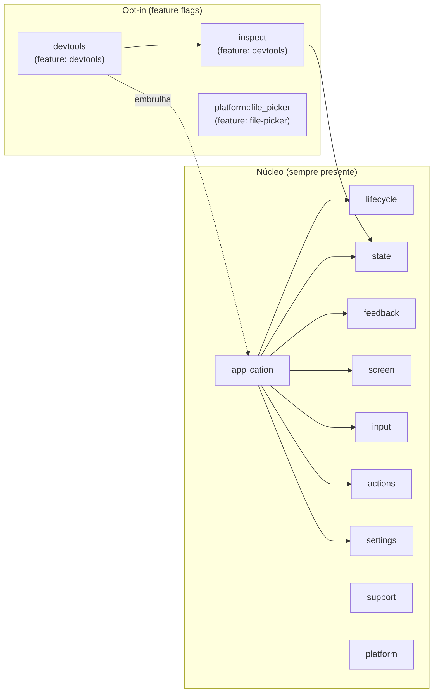

# L3 — Componentes de `nive-runtime`

Facades públicos do crate de runtime e como se relacionam. O módulo `application` é o
orquestrador; seus submódulos internos mantêm o *program runner* como única ponte com
o loop do Iced.

```mermaid
flowchart LR
    subgraph rt["nive-runtime"]
        direction TB
        app["application<br/>módulo<br/>Trait Application, run(), program runner (ponte Iced), Effect, Context, Config, ThemeController, FocusRoot por janela"]
        actions["actions<br/>módulo<br/>ActionMap / Action: catálogo de comandos (alimenta atalhos e command palette)"]
        lifecycle["lifecycle<br/>módulo<br/>BootstrapSpec (splash), WindowSpec/Registry/Command (multi-janela), handshakes close/exit"]
        state["state<br/>módulo<br/>Resource&lt;T&gt;, Operation&lt;C&gt;, OperationRegistry, RequestId, clock"]
        feedback["feedback<br/>módulo<br/>ToastState (fila), Toast/ToastTone, UserFacingError"]
        screen["screen<br/>módulo<br/>ScreenView, ScreenEffect, DialogRequest/Dismiss"]
        input["input<br/>módulo<br/>ShortcutMap, keyboard_navigation_subscription, KeyboardNavigation"]
        settings["settings<br/>módulo<br/>SettingsConfig, RuntimeSession, store (persistência serde)"]
        platform["platform<br/>módulo<br/>app_icon (objc2/winres), file_picker (rfd, feature-gated)"]
        support["support<br/>módulo<br/>DiagnosticEventLog, DiagnosticSnapshot, panic hook diagnóstico"]
        devtools["devtools<br/>módulo (feature)<br/>Painel: host, view, probe, simuladores de estado"]
        inspect["inspect<br/>módulo (feature)<br/>Trait Inspect, ResourceSimulator, OperationSimulator"]
    end

    ui["nive-ui<br/>Design system + widgets"]
    core["nive-core<br/>Contratos de apresentação"]
    derive["nive-runtime-derive<br/>#[derive(Inspect)]"]
    iced["Iced<br/>Task, Subscription, window, Element"]

    app -->|consome<br/>bootstrap + janelas| lifecycle
    app -->|renderiza via| screen
    app -->|resolve atalhos/foco| input
    app -->|lê catálogo| actions
    app -->|drena toasts do Effect| feedback
    app -->|carrega/salva preferências| settings
    app -->|program runner traduz para<br/>Iced Program| iced

    state -->|usa UserFacingError| feedback
    screen -->|compõe widgets de| ui
    state -->|implementa contratos de apresentação de| core
    feedback -->|implementa contratos de apresentação de| core
    app -->|tema, hosts de overlay| ui

    devtools -->|coleta snapshot via| inspect
    devtools -->|embrulha (run_with_devtools)| app
    inspect -->|derivado por| derive
    inspect -->|simula Resource/Operation| state

    classDef component fill:#e8f1ff,stroke:#4b77be,color:#111;
    classDef external fill:#eee,stroke:#999,color:#333;
    class app,actions,lifecycle,state,feedback,screen,input,settings,platform,support,devtools,inspect component;
    class ui,core,derive,iced external;
```

## Mapa de responsabilidades



## Notas

- **`application` é o orquestrador**; tudo o mais é biblioteca que ele compõe. O *program
  runner* (`application/program.rs`) permanece privado — apps emitem `Effect` e
  `WindowCommand`, não chamam helpers diretos de janela Iced.
- **Cada view final de janela recebe exatamente um `FocusRoot`.** O runner o
  aplica fora de conteúdo normal/secundário, bootstrap, devtools, `DialogHost`
  e `ToastHost`, garantindo um coordenador independente por árvore/janela. A
  aplicação não mantém estado ou id de foco e não deve adicionar outra raiz.
- **`state` e `feedback` são headless:** máquinas de estado (`Resource`, `Operation`) e
  `UserFacingError` não desenham pixels; implementam os *contratos de apresentação*
  definidos em `nive-core` (`ResourceStatusPresentation`, etc.) que os widgets de `nive-ui`
  consomem via reexport. Isso mantém `nive-ui` ignorante do runtime e evita que a UI seja a
  dona de um contrato headless.
- **`devtools` + `inspect` são totalmente feature-gated** — zero peso em release.
