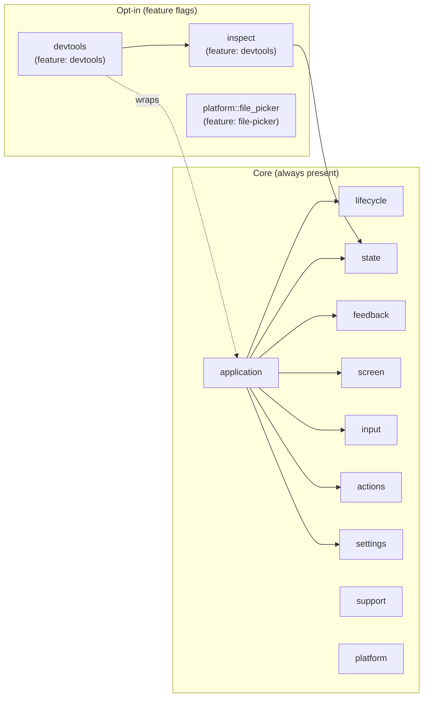

# L3 — `nive-runtime` Components

The runtime crate's public facades and how they relate. The `application` module
is the orchestrator; its internal submodules keep the *program runner* as the
single bridge to Iced's loop.

```mermaid
flowchart LR
    subgraph rt["nive-runtime"]
        direction TB
        app["application<br/>module<br/>The Application trait, run(), the program runner (Iced bridge), Effect, Context, Config, ThemeController, a per-window FocusRoot"]
        actions["actions<br/>module<br/>ActionMap / Action: the command catalogue feeding shortcuts and the command palette"]
        lifecycle["lifecycle<br/>module<br/>BootstrapSpec (splash), WindowSpec/Registry/Command (multi-window), close/exit handshakes"]
        state["state<br/>module<br/>Resource&lt;T&gt;, Operation&lt;C&gt;, OperationRegistry, RequestId, clock"]
        feedback["feedback<br/>module<br/>ToastState (the queue), Toast/ToastTone, UserFacingError"]
        screen["screen<br/>module<br/>ScreenView, ScreenEffect, DialogRequest/Dismiss"]
        input["input<br/>module<br/>ShortcutMap, keyboard_navigation_subscription, KeyboardNavigation"]
        settings["settings<br/>module<br/>SettingsConfig, RuntimeSession, store (serde persistence)"]
        platform["platform<br/>module<br/>app_icon (objc2/winres), file_picker (rfd, feature-gated)"]
        support["support<br/>module<br/>DiagnosticEventLog, DiagnosticSnapshot, the diagnostic panic hook"]
        devtools["devtools<br/>module (feature)<br/>The panel: host, view, probe, state simulators"]
        inspect["inspect<br/>module (feature)<br/>The Inspect trait, ResourceSimulator, OperationSimulator"]
    end

    ui["nive-ui<br/>Design system + widgets"]
    core["nive-core<br/>Presentation contracts"]
    derive["nive-runtime-derive<br/>#[derive(Inspect)]"]
    iced["Iced<br/>Task, Subscription, window, Element"]

    app -->|consumes<br/>bootstrap + windows| lifecycle
    app -->|renders through| screen
    app -->|resolves shortcuts/focus| input
    app -->|reads the catalogue| actions
    app -->|drains toasts out of Effect| feedback
    app -->|loads/saves preferences| settings
    app -->|the program runner translates into an<br/>Iced Program| iced

    state -->|uses UserFacingError| feedback
    screen -->|composes widgets from| ui
    state -->|implements presentation contracts from| core
    feedback -->|implements presentation contracts from| core
    app -->|theme, overlay hosts| ui

    devtools -->|collects a snapshot through| inspect
    devtools -->|wraps (run_with_devtools)| app
    inspect -->|derived by| derive
    inspect -->|simulates Resource/Operation| state

    classDef component fill:#e8f1ff,stroke:#4b77be,color:#111;
    classDef external fill:#eee,stroke:#999,color:#333;
    class app,actions,lifecycle,state,feedback,screen,input,settings,platform,support,devtools,inspect component;
    class ui,core,derive,iced external;
```

## Responsibility map



## Notes

- **`application` is the orchestrator**; everything else is library it composes.
  The *program runner* (`application/program.rs`) stays private — apps emit
  `Effect` and `WindowCommand` rather than calling Iced window helpers directly.
- **Every final window view gets exactly one `FocusRoot`.** The runner applies it
  outside normal and secondary content, bootstrap, devtools, `DialogHost`, and
  `ToastHost`, which guarantees one independent coordinator per tree or window.
  The application holds no focus state or id and must not add a second root.
- **`state` and `feedback` are headless:** the state machines (`Resource`,
  `Operation`) and `UserFacingError` paint no pixels. They implement the
  *presentation contracts* defined in `nive-core`
  (`ResourceStatusPresentation` and friends) that `nive-ui`'s widgets consume
  through a re-export. That keeps `nive-ui` ignorant of the runtime and stops the
  UI from owning a headless contract.
- **`devtools` and `inspect` are entirely feature-gated** — zero weight in
  release builds.
