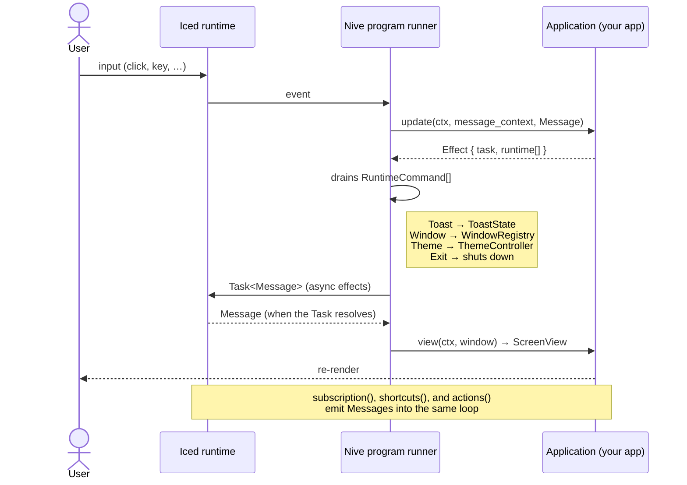
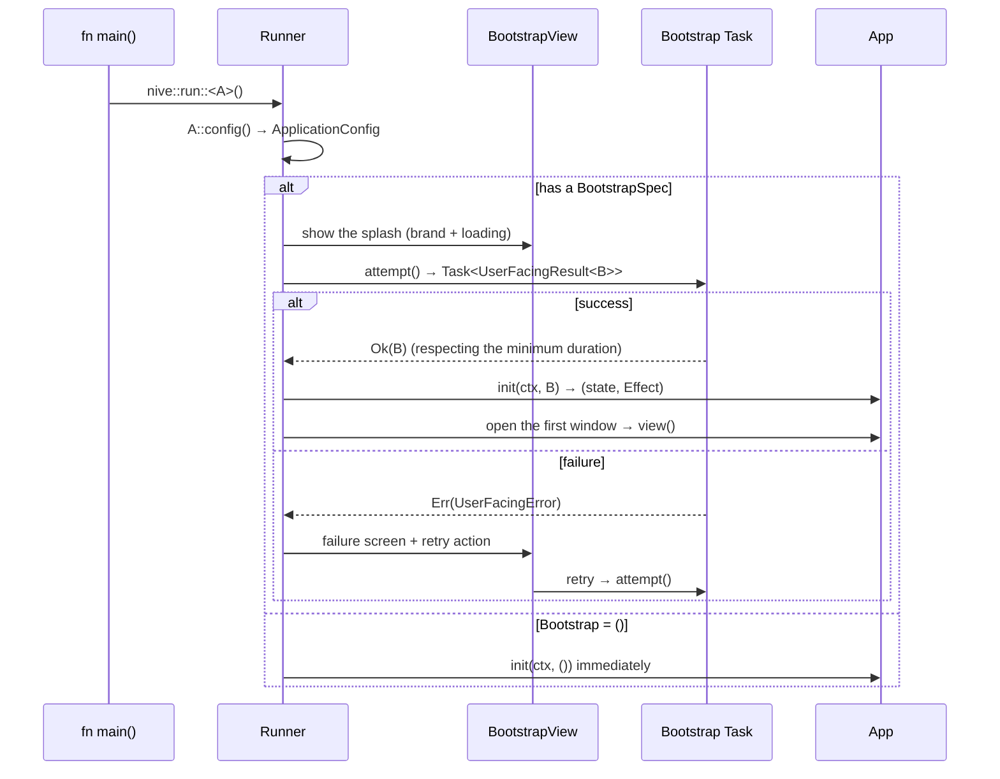
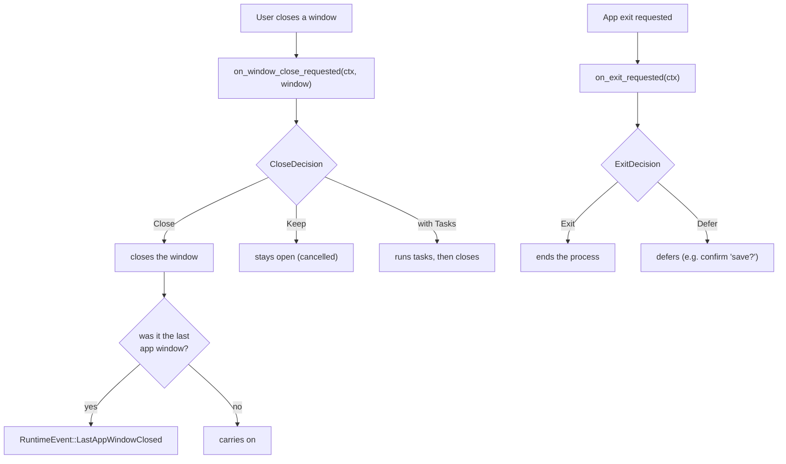
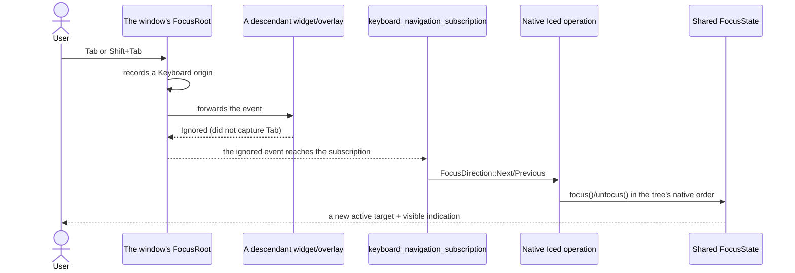
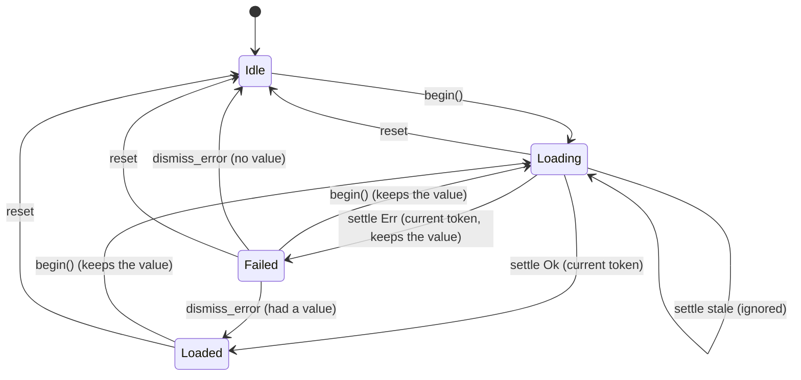
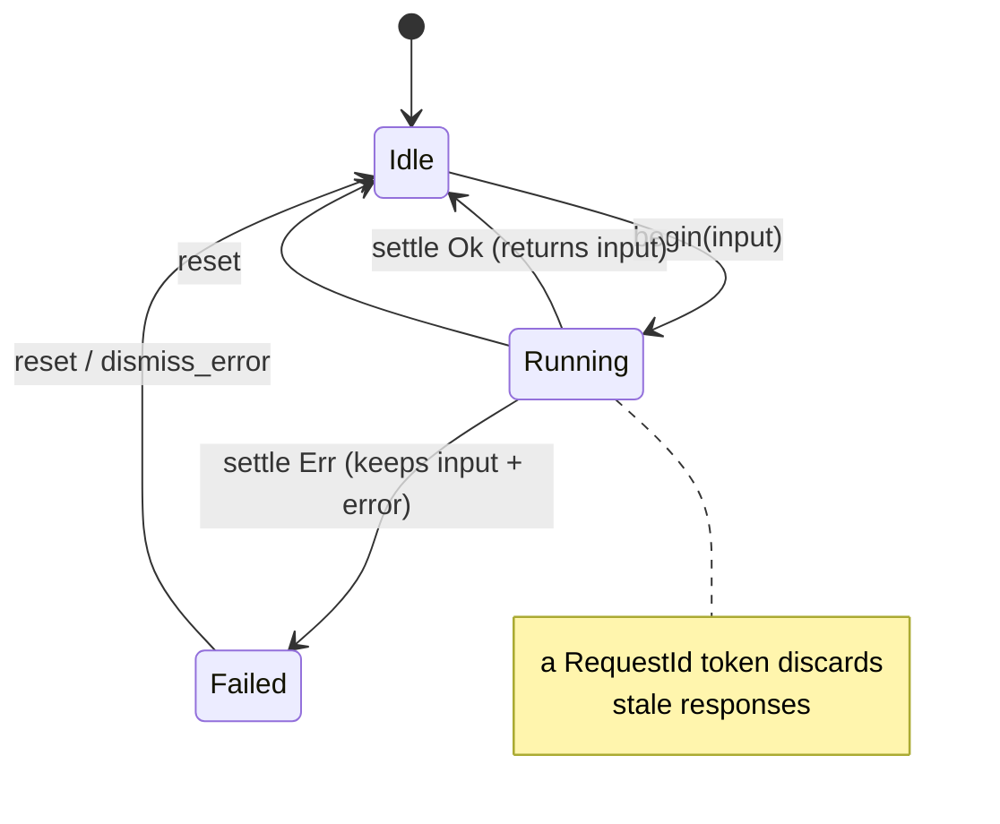
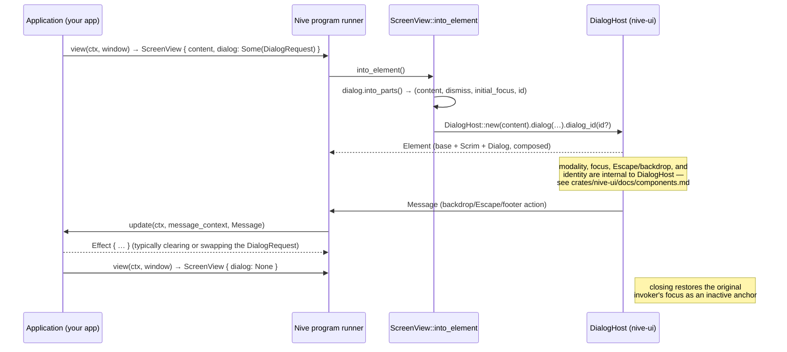

# Runtime Flows and State Machines

`nive-runtime`'s dynamic behaviour: the Elm loop, bootstrap/splash, the window
handshake, and the asynchronous state machines.

---

## 1. The update loop (Elm architecture)

The private *program runner* mediates between Iced and your `Application`. Every
`update` returns an `Effect` combining a `Task` with an ordered list of
`RuntimeCommand`s (internal) that the runtime **drains** after the update.



**Key types:** `Effect<M, K = Never>` (what `Application`'s hooks return; no
outcome axis) · `RuntimeCommand<K>` (crate-internal) = `Toast | Window | Theme |
Exit`.

---

## 2. Bootstrap and splash

`BootstrapSpec` wraps the initialisation task (building the product's clients and
services), with a minimum splash duration, stale-result rejection, and retry.
Apps without a splash use `type Bootstrap = ()` and get an instant bootstrap.



---

## 3. Window handshake (close / exit)

Multi-window is first class: `WindowSpec` and `WindowRegistry` orchestrate
opening, focus, and closing. The app can intercept both close and exit.



**Runtime events** delivered through `on_runtime_event`: `WindowOpened`,
`WindowClosed`, `WindowFocused`, `LastAppWindowClosed`, `ThemeChanged`,
`CommandRejected`, `PlatformError`.
**Window attributes:** `WindowRole` (App | Auxiliary), `WindowCardinality`
(Single | Multiple), `WindowMode` (Windowed | Maximized | Fullscreen),
`WindowChrome`.

---

## 4. Logical focus navigation

Every `Program::view` wraps the window's final element exactly once in
`nive_ui::accessibility::FocusRoot`, outside content, hosts, and overlays. The
coordinator stays local to that window's tree; the application receives no
manager and keeps no focus graph.



A primary press or touch on a managed target replaces the anchor and, under the
`Auto` policy, normally hides the indication. A press on empty content clears
active and visible focus but keeps a valid anchor for the next Tab. Composite and
selection state are not transferred to the runtime. The recursive overlay chain
uses the same coordinator; the overlay's policy decides only entry, containment,
and conditional restoration.

---

## 5. State machine: `Resource<T>` (request/response)

An asynchronously loaded value with *stale-while-revalidate* — it keeps the
previous value while reloading — and discards stale responses by `RequestId`.



Sugar: `Resource::load(future, Msg::Settled)` fuses `begin()` with spawning the
`Task` and maps the result into `Settled<T>`, leaving the token as invisible
plumbing.

---

## 6. State machine: `Operation<C>` (command/action)

An asynchronous action with no persistent return value — saving, deleting. On
success it hands the `input` back to the caller; on failure it keeps `input` plus
the error.



Collections of in-flight actions are managed by `OperationRegistry` — several
table rows saving in parallel, for instance.

---

## 7. The toast queue

`ToastState` holds active slots plus a `VecDeque` of pending ones. Each toast has
a severity (`ToastTone`) and a position (`ToastPosition`); short and long
durations expire on their own.

```mermaid
flowchart LR
    push["push(Toast, now)"] --> cap{a free active slot?}
    cap -->|yes| active["active (visible)"]
    cap -->|no| queued["VecDeque queue"]
    active -->|expire(now) / dismiss(id)| promote["promotes the next"]
    promote --> active
    queued -.-> promote
```

---

## 8. Dialog hosting (`ScreenView` → `DialogHost`)

`Application::view()` returns a `ScreenView` carrying content plus an optional
`DialogRequest`. `ScreenView::into_element()` — called by the runner, not by the
app — takes the request apart and assembles the `DialogHost` automatically; the
app never instantiates `DialogHost` itself. Dismissal and dialog actions
(backdrop, Escape, footer buttons) are ordinary `Message`s coming back through the
same loop as section 1; there is no second state channel. The app closes the
dialog simply by returning `dialog: None` — or a different `DialogRequest` — from
the next `view()`.



One `ScreenView` per window structurally enforces at most one modal dialog per
window (`Option<DialogRequest>`); a new `dialog(…)` replaces the previous one
rather than stacking. Hosting a `DialogHost` by hand inside app content, outside
this automatic path, is not supported.
