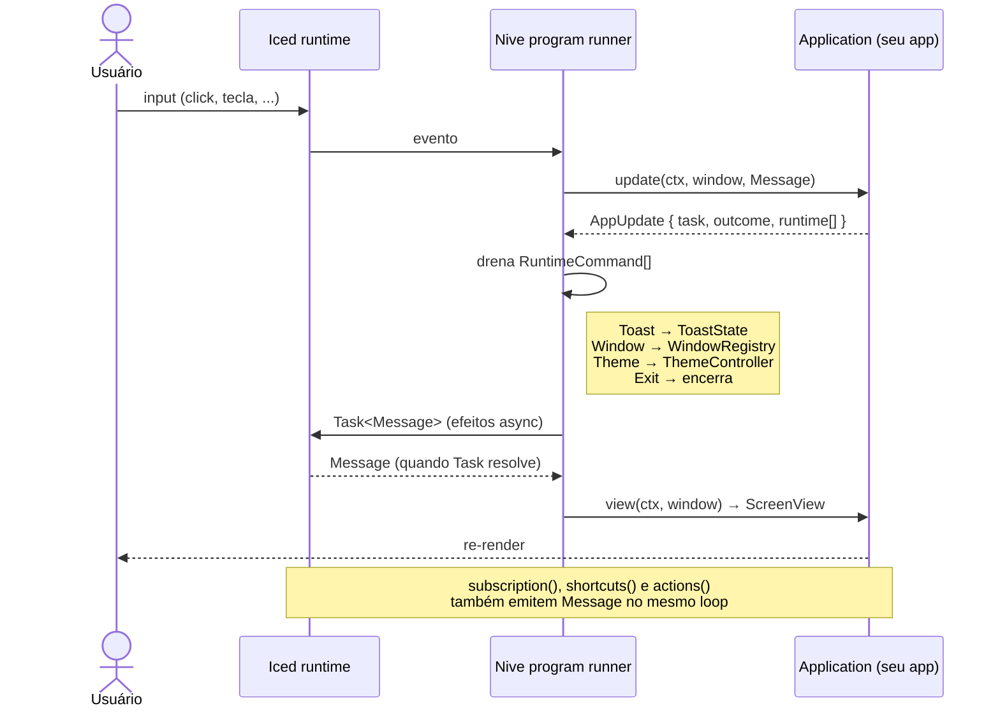
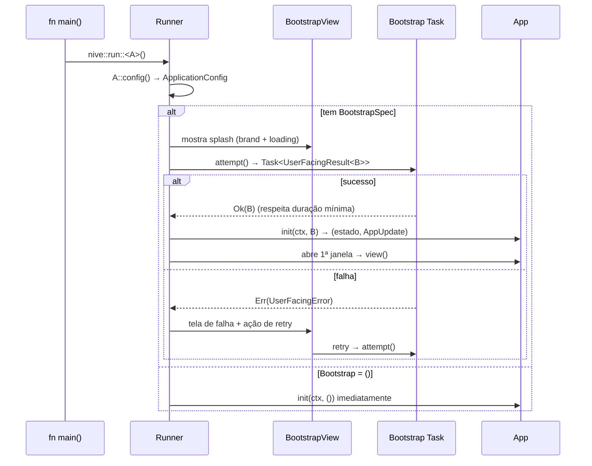
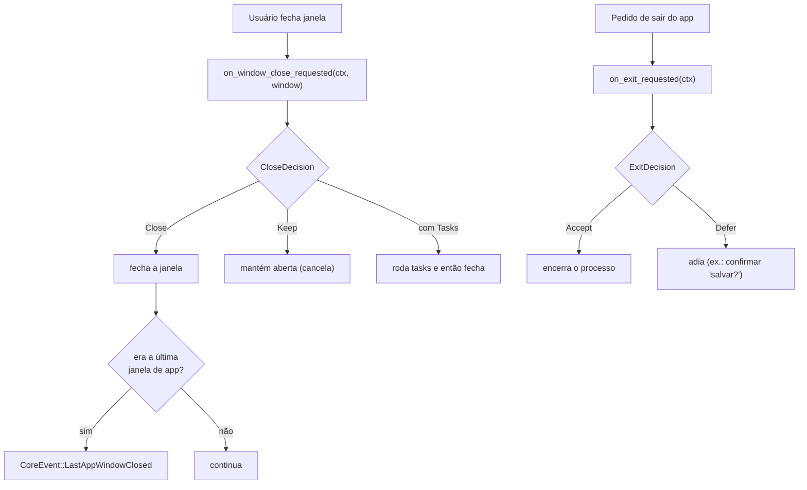
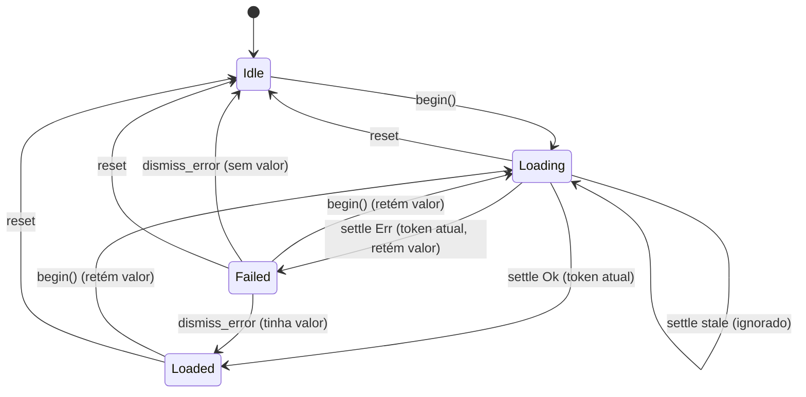
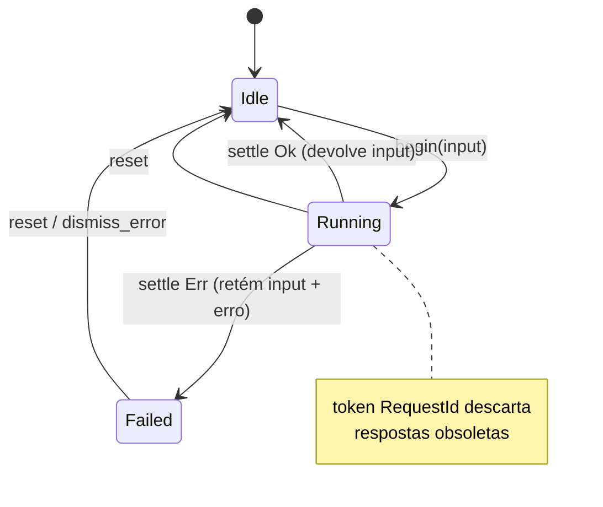

# Fluxos de Runtime & Máquinas de Estado

Comportamento dinâmico do `nive-runtime`: o loop Elm, o bootstrap/splash, o handshake de
janelas e as máquinas de estado assíncrono.

---

## 1. Loop de atualização (arquitetura Elm)

O *program runner* (privado) media entre o Iced e o seu `Application`. Cada `update`
devolve um `AppUpdate` que combina um `Task`, um `outcome` opcional e uma lista ordenada de
`RuntimeCommand`s que o runtime **drena** após o update.



**Tipos-chave:** `Update<M, O, K>` (genérico) · `AppUpdate<M, K> = Update<M, Never, K>` (o
que os hooks de `Application` retornam) · `RuntimeCommand<K>` = `Toast | Window | Theme |
Exit`.

---

## 2. Bootstrap & Splash

`BootstrapSpec` encapsula a tarefa de inicialização (construir clientes/serviços do
produto), com duração mínima de splash, rejeição de resultado obsoleto e retry. Apps sem
splash usam `type Bootstrap = ()` e recebem um bootstrap instantâneo.



---

## 3. Handshake de Janela (close / exit)

Multi-janela é de primeira classe: `WindowSpec`/`WindowRegistry` orquestram abertura, foco e
fechamento. O app pode interceptar o fechamento e a saída.



**Eventos de runtime** entregues via `on_core_event`: `WindowOpened`, `WindowClosed`,
`WindowFocused`, `LastAppWindowClosed`, `ThemeChanged`, `CommandRejected`, `PlatformError`.
**Atributos de janela:** `WindowRole` (App | Auxiliary), `WindowCardinality` (Single |
Multiple), `WindowMode` (Windowed | Maximized | Fullscreen), `WindowChrome`.

---

## 4. Máquina de estado: `Resource<T>` (request/response)

Valor carregado assincronamente, com *stale-while-revalidate* (retém o valor anterior
enquanto recarrega) e descarte de respostas obsoletas por `RequestId`.



Açúcar: `Resource::load(future, Msg::Settled)` funde `begin()` + spawn do `Task` e mapeia o
resultado em `Settled<T>` (o token vira plumbing invisível).

---

## 5. Máquina de estado: `Operation<C>` (comando/ação)

Ação assíncrona sem valor de retorno persistente (ex.: salvar, deletar). Em sucesso devolve
o `input` para o chamador; em falha, retém `input` + erro.



Coleções de ações em voo são geridas por `OperationRegistry` (ex.: várias linhas salvando
em paralelo numa tabela).

---

## 6. Fila de Toasts

`ToastState` mantém slots ativos + uma `VecDeque` de pendentes. Cada toast tem severidade
(`ToastTone`) e posição (`ToastPosition`); duração curta/longa expira sozinha.

```mermaid
flowchart LR
    push["push(Toast, now)"] --> cap{slot ativo livre?}
    cap -->|sim| active["ativo (visível)"]
    cap -->|não| queued["fila VecDeque"]
    active -->|expire(now) / dismiss(id)| promote["promove próximo"]
    promote --> active
    queued -.-> promote
```
