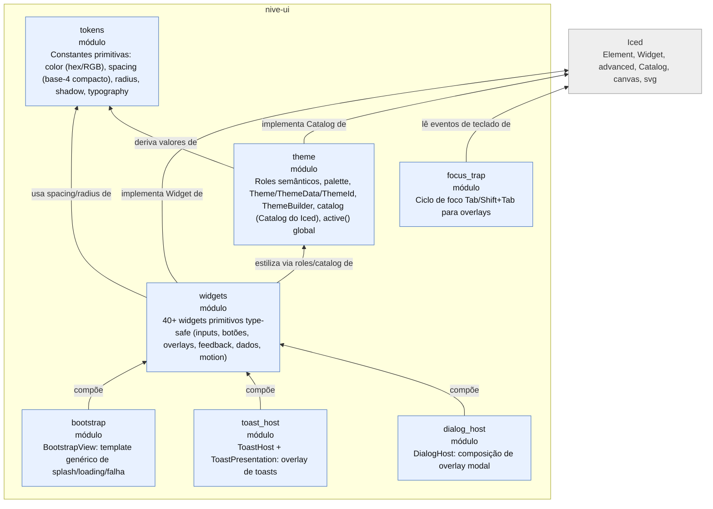
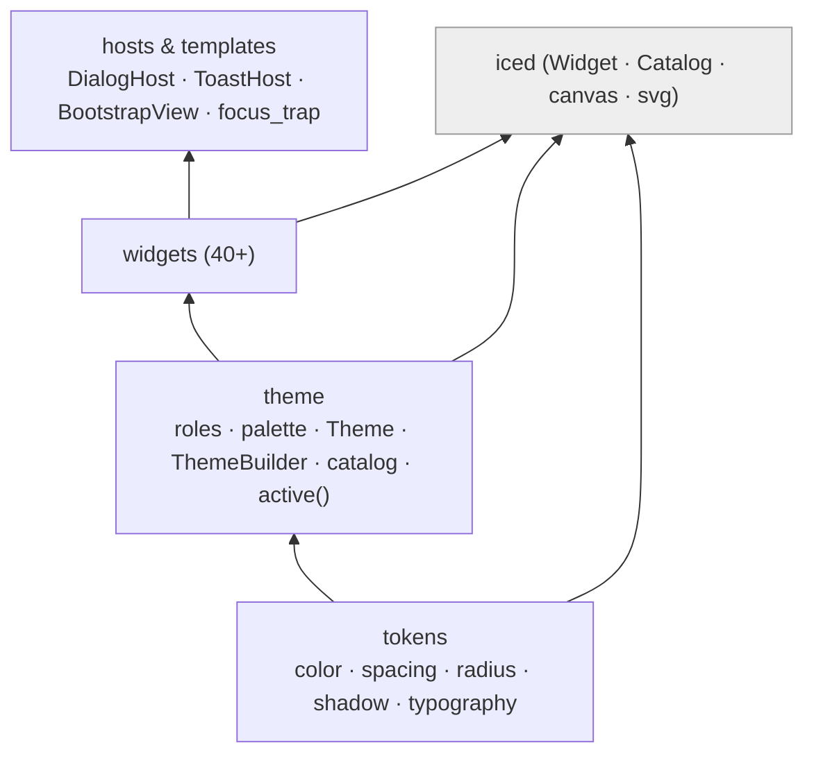

# L3 — Componentes de `nive-ui`

Módulos internos do design system. Fluxo de baixo para cima: **tokens → theme → widgets →
hosts**. Tudo depende apenas de `iced`.

## Pilha do design system

## Notas

- **`nive-ui` é a camada base e não conhece `nive-runtime`.** Contratos de apresentação
  (ex.: `ResourceStatusPresentation`, `ToastPresentation`, `ErrorPresentation`) são traits
  *no `nive-ui`* que o runtime implementa — invertendo a dependência para manter o design
  system reutilizável de forma isolada.
- **`active()` expõe um tema global** (estado em thread-local) para que widgets leiam o tema
  ativo sem prop-drilling — útil em densidade alta onde passar `&Theme` em todo lugar
  seria ruído.
- Catálogo de widgets detalhado em [`design-system.md`](design-system.md).
