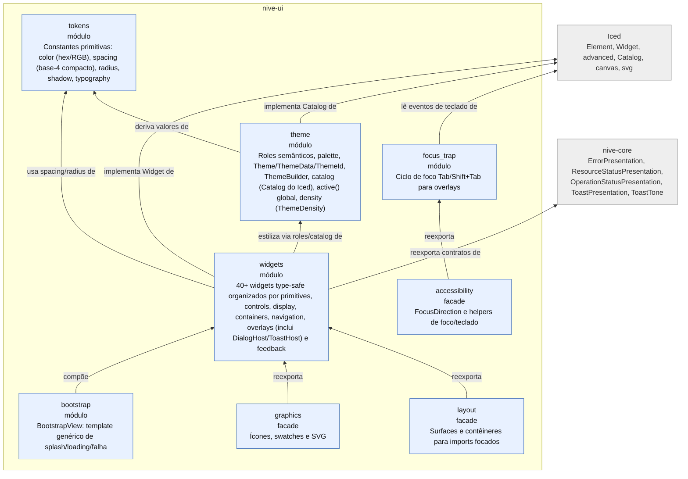
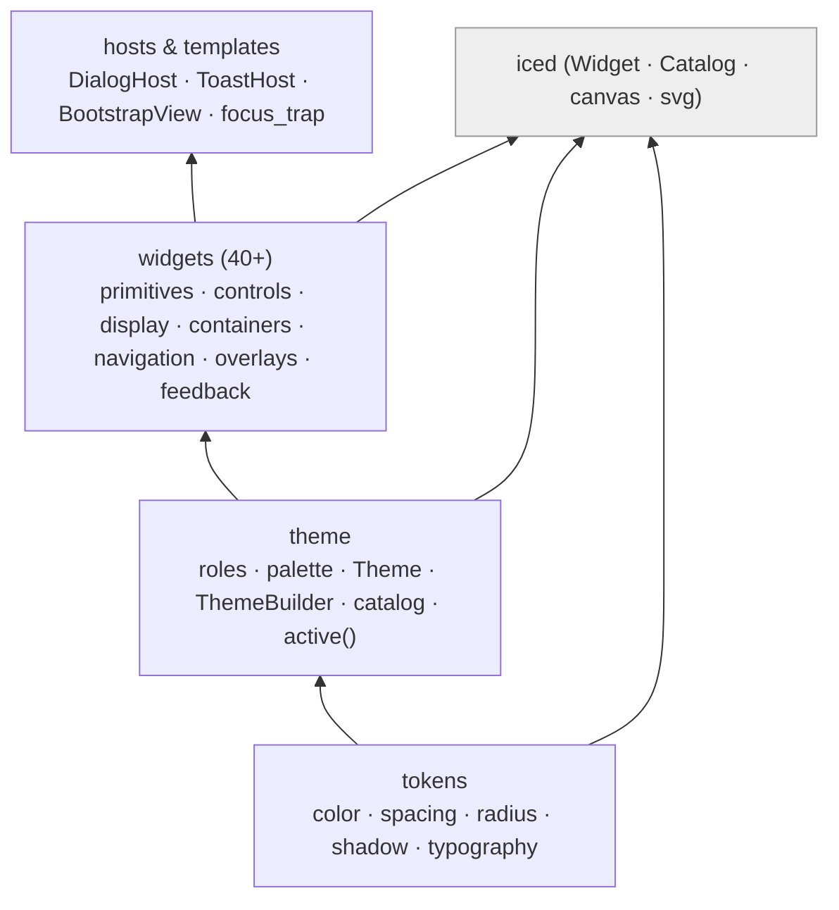

# L3 — Componentes de `nive-ui`

Módulos internos do design system. Fluxo de baixo para cima: **tokens → theme → widgets →
hosts**. Depende de `iced` e de `nive-core` (contratos de apresentação de erro/toast/status).

## Pilha do design system

## Notas

- **`nive-ui` é a camada base e não conhece `nive-runtime`.** Contratos de apresentação
  (ex.: `ResourceStatusPresentation`, `ToastPresentation`, `ErrorPresentation`, `ToastTone`)
  vivem em `nive-core` (zero dependências) e são reexportados por `nive-ui`; o runtime os
  implementa. Isso mantém o design system reutilizável de forma isolada sem inverter a
  fronteira de ownership de um contrato headless para dentro da camada de UI.
- **`active()` expõe um tema global** (estado em thread-local) para que widgets leiam o tema
  ativo sem prop-drilling — útil em densidade alta onde passar `&Theme` em todo lugar
  seria ruído.
- Catálogo de widgets detalhado em [`design-system.md`](design-system.md).
