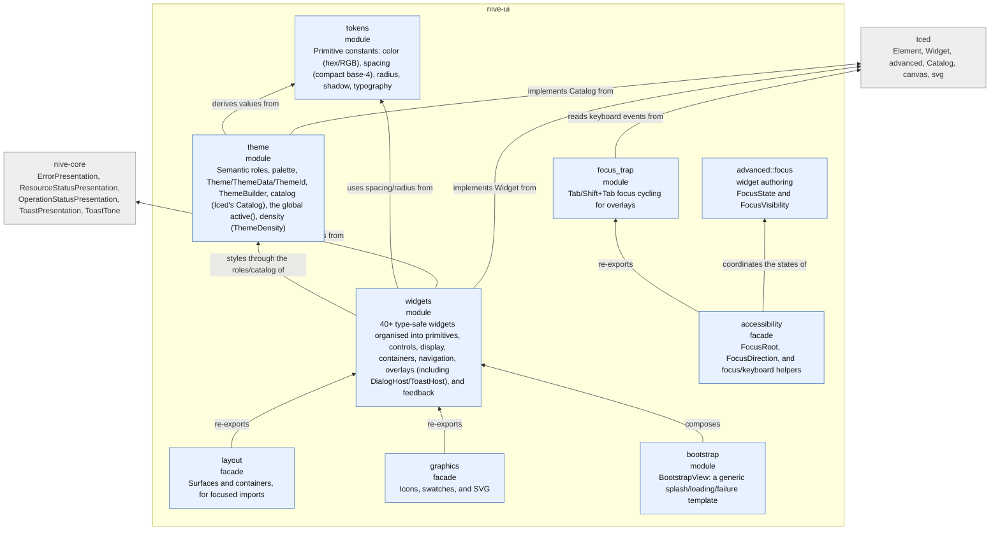
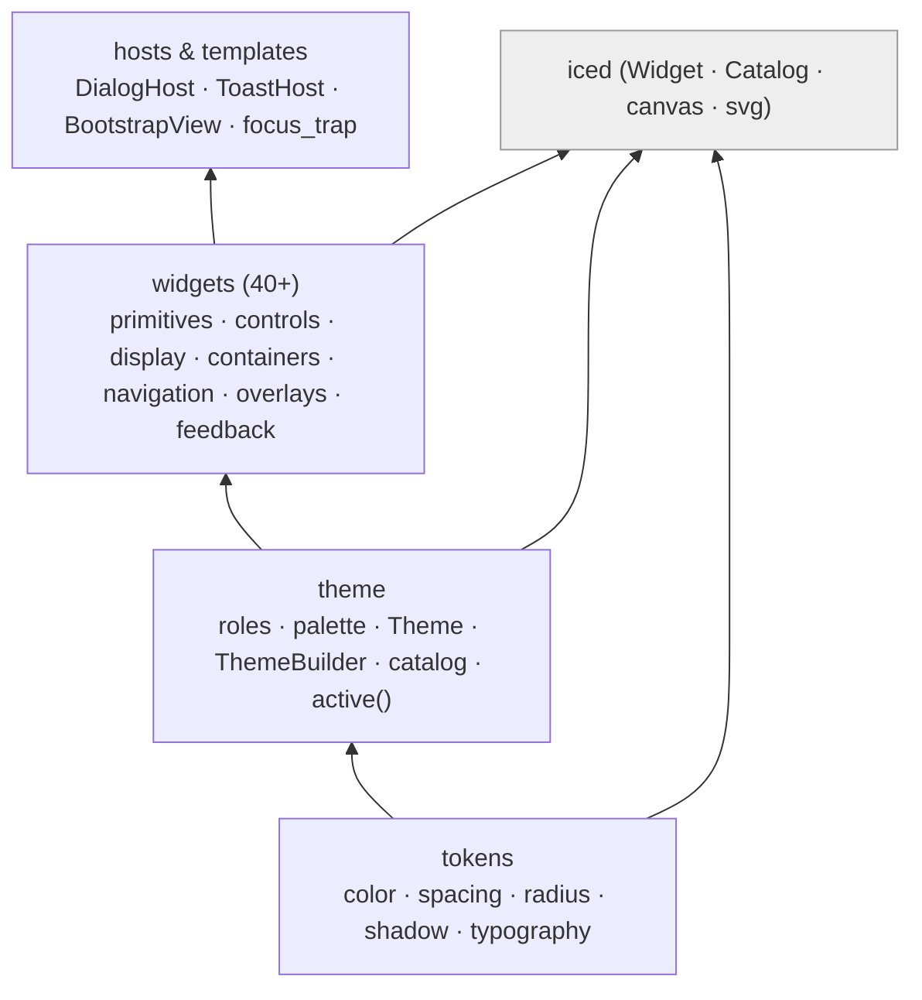

# L3 — `nive-ui` Components

The design system's internal modules. The flow runs bottom-up: **tokens → theme →
widgets → hosts**. It depends on `iced` and on `nive-core` (the presentation
contracts for error, toast, and status).

## The design system stack

## Notes

- **`nive-ui` is the base layer and knows nothing about `nive-runtime`.**
  Presentation contracts — `ResourceStatusPresentation`, `ToastPresentation`,
  `ErrorPresentation`, `ToastTone` — live in `nive-core` (zero dependencies) and
  are re-exported by `nive-ui`; the runtime implements them. That keeps the design
  system reusable on its own without inverting ownership of a headless contract
  into the UI layer.
- **`active()` exposes a global theme** (thread-local state) so widgets can read
  the active theme without prop drilling — worth it at high density, where passing
  `&Theme` everywhere would be noise.
- **Managed focus has exactly one owner per tree or window.** `FocusRoot` holds a
  single sequential logical anchor and propagates it through the whole overlay
  chain; next/previous ordering is still computed by Iced's native operations.
  `nive-runtime` installs the root automatically, while a standalone `nive-ui` app
  opts in explicitly at the final composition.
- **`FocusState` is advanced authoring surface, not application state.** Each
  external target registers a persistent state; active focus and visible
  indication belong to that layer. A composite's roving/highlighted item, durable
  selection, and overlay entry/restore policy stay with their own components.
- The full widget catalogue is in [`design-system.md`](design-system.md).
